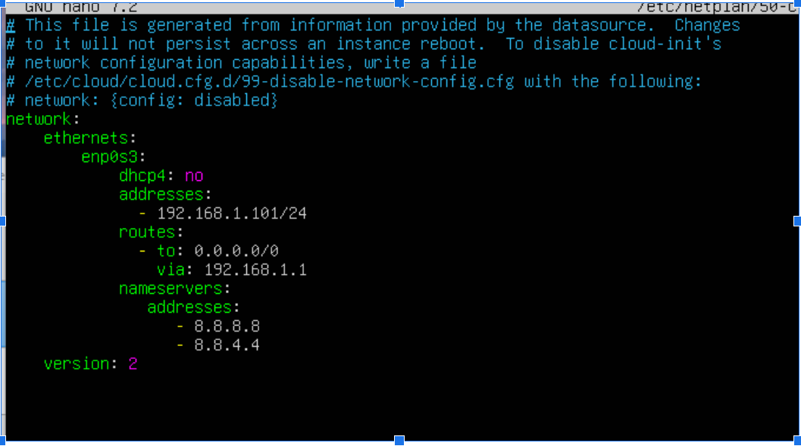

# Cài đặt Kubernetes cluster 1 master, 2 worker trên Ubuntu 24.04

## 1. Giới thiệu

Có nhiều cách để cài đặt k8s, trong tài liệu này giới thiệu cài đặt thủ công k8s trên ubuntu 24.04 để gần với môi trường production nhất

## 2. Yêu cầu hệ thống

Trong môi trường thử nghiệm:

- **HP 240 GM Notebook Intel core I5 2.4Ghz, Ram: 16GB:** Cài đặt 4 máy ảo bằng virutalbox
- **Kubernetes cluster: 01 Master, 02 Worker, 01 NFS**
- **Phiên bản hệ điều hành: Ubuntu Server 24.04**

Lưu ý trên đây chỉ là mô hình thử nghiệm, còn môi trường production nên thực hiện ít nhất: **Kubernetes cluster: 03 Master, 08 Worker** để đảm bảo [High Availability (HA)](https://kubernetes.io/docs/setup/production-environment/tools/kubeadm/ha-topology/) hoặc nhiều hơn tùy thuộc vào độ lớn của dự án


| Tên máy/hostmane/Node          | Hệ điều hành | IP | Vai trò |
|----------------------|----------------|----------------|-----------|
| master.xtl    | ubuntu 24.04              | 192.168.1.100           | master  |
| worker1.xtl | ubuntu 24.04              | 192.168.1.101          | worker 1 |
| worker2.xtl  | ubuntu 24.04             | 192.168.1.102            | worker 2  |
| nfs.xtl  | ubuntu 24.04             | 192.168.1.110            | NFS  |

## 3. Tiến hành cài đặt

### 3.1. Cài đặt IP cho server nếu chưa cấu hình

Đầu tiên kiểm tra IP hiện tại và cổng mạng của máy tính bằng lệnh
```bash 
ip addr show
```

Đổi thành IP tĩnh

```bash 
sudo nano /etc/netplan/00-installer-config.yaml
```
Sau đó, sửa nội dung file thành như sau lưu lại (Ctrl + O) và thoát ra (Ctrl + X)



Tiếp theo chạy lệnh netplan apply để áp dụng thông số vừa mới thay đổi

```bash 
sudo netplan apply
```
Tham khảo:
[Dùng virtualbox cài các máy ảo, dùng Bridged Adapter để cài ip tĩnh](https://thuanbui.me/static-ip-address-ubuntu-20-04/)

### 3.2. Cập nhật hệ điều hành và cập nhật hosts
Sau khi cài đặt hệ điều hành, cần cập nhật hệ thống:
```bash 
sudo apt update
sudo apt upgrade -y
```

Đặt hostname và cập nhật hosts file
Master node
```bash
sudo hostnamectl set-hostname "master.xtl"
```

Worker 1
```bash
sudo hostnamectl set-hostname "worker1.xtl"
```
Worker 2
```bash 
sudo hostnamectl set-hostname "worker2.xtl"
```

Tiếp theo chúng ta cập nhật file /etc/hosts file của tất cả các node.

Cài nano editor nếu server chưa có
```bash 
sudo apt install -y nano 
```
Mở chỉnh sửa file etc/hosts
```bash
sudo nano /etc/hosts
```

Sau đó thêm vào bên dưới file nội dung dưới đây:

```bash
192.168.1.100   master.xtl
192.168.1.101   worker1.xtl
192.168.1.102   worker2.xtl
192.168.1.110   nfs.xtl
```

### 3.3. Disable swap và cập nhật kernel

Các lệnh dưới đây thực hiện trên tất cả các node
```bash
sudo swapoff -a
```

Kiểm tra lại xem swap đã disabled hay chưa bằng lệnh free -h, nếu thành công kết quả sẽ như dưới đây:

```bash
$ free -h
               total        used        free      shared  buff/cache   available
Mem:           7.7Gi       167Mi       7.1Gi       1.0Mi       437Mi   7.3Gi
Swap:             0B          0B          0B

```

Tiếp theo disable swap trong /etc/fstab
```bash
sudo nano /etc/fstab
```

Tìm dòng: /swap.img none swap sw 0 0 và cập nhật lại thành:
```bash
#/swap.img       none       swap       sw       0       0
```

Sau đó chạy tiếp các lệnh:
```bash
sudo mount -a
```

```bash
free -h
```

### 3.4. Load the following kernel modules on all the nodes:

```bash
sudo tee /etc/modules-load.d/containerd.conf <<EOF
overlay
br_netfilter
EOF
```

```bash
sudo modprobe overlay
sudo modprobe br_netfilter

```

### 3.5. Set the following Kernel parameters for Kubernetes.

```bash
sudo tee /etc/sysctl.d/kubernetes.conf <<EOF
net.bridge.bridge-nf-call-ip6tables = 1
net.bridge.bridge-nf-call-iptables = 1
net.ipv4.ip_forward = 1
EOF
```

Sau đó reload lại sysctl

```bash
sudo sysctl --system
```

### 3.6. Cài đặt containerd run time

Chạy các lệnh dưới đây trên tất cả các node

```bash
sudo apt install -y curl gnupg2 software-properties-common apt-transport-https ca-certificates
sudo curl -fsSL https://download.docker.com/linux/ubuntu/gpg | sudo gpg --dearmour -o /etc/apt/trusted.gpg.d/docker.gpg
sudo add-apt-repository "deb [arch=amd64] https://download.docker.com/linux/ubuntu $(lsb_release -cs) stable"
sudo apt update
sudo apt install -y containerd.io
```

### 3.7. Thêm cấu hình containerd.

```bash
containerd config default | sudo tee /etc/containerd/config.toml >/dev/null 2>&1
sudo sed -i 's/SystemdCgroup \= false/SystemdCgroup \= true/g' /etc/containerd/config.toml
sudo systemctl restart containerd
sudo systemctl enable containerd
```

### 3.8. Cài đặt Kubernetes

Chạy các lệnh dưới đây trên tất cả các node

Kiểm tra hệ điều hành

```bash
lsb_release -a
```

Nếu Codename: noble thì chạy (trong bài viết này đang chạy theo cách này)

```bash
curl -s https://packages.cloud.google.com/apt/doc/apt-key.gpg | sudo apt-key add -
curl -fsSL https://pkgs.k8s.io/core:/stable:/v1.30/deb/Release.key | sudo gpg --dearmor -o /etc/apt/keyrings/k8s.gpg
echo 'deb [signed-by=/etc/apt/keyrings/k8s.gpg] https://pkgs.k8s.io/core:/stable:/v1.30/deb/ /' | sudo tee /etc/apt/sources.list.d/k8s.list
sudo apt update
sudo apt install -y kubelet kubeadm kubectl
sudo apt-mark hold kubelet kubeadm kubectl
```

Nếu Codename: xenial thì chạy 

```bash
curl -s https://packages.cloud.google.com/apt/doc/apt-key.gpg | sudo apt-key add -
sudo apt-add-repository "deb http://apt.kubernetes.io/ kubernetes-xenial main"
sudo apt update
sudo apt install -y kubelet kubeadm kubectl
sudo apt-mark hold kubelet kubeadm kubectl

```

### 3.9. Khởi tạo cluster bằng kubeadm
Chỉ chạy lênh dưới đây trên master node
```bash
sudo kubeadm init \
  --pod-network-cidr=10.10.0.0/16 \
  --control-plane-endpoint=master.xtl

```

Trong đó 10.10.0.0/16 là CIDR của pod network, bạn có thể thay theo nhu cầu.

Tiếp theo, thực thi các lệnh dưới đây trên master node

```bash
mkdir -p $HOME/.kube
sudo cp -i /etc/kubernetes/admin.conf $HOME/.kube/config
sudo chown $(id -u):$(id -g) $HOME/.kube/config

```

### 3.10. Chúng ta thử chạy lệnh để kiếm tra trạng thái của cluster
```bash
kubectl cluster-info
kubectl get nodes


```

Chúng ta thấy là control plane đang chạy và hiện tại chỉ có mỗi master node, chúng ta sẽ tiến hành thêm worker node vào cluster này.

### 3.11. Thêm worker node vào cluster

Lưu ý: Chạy trên master, lấy mã kết nối worker vào master
```bash
 kubeadm token create --print-join-command
```

Sau đó, copy đầu ra vào worker, ví dụ:
Lưu ý: Các lệnh dưới đây chỉ chạy trên các worker node

```bash
sudo kubeadm join master.xtl:6443 --token pow1z7.c4f9zyzy7i6u0cdt \
        --discovery-token-ca-cert-hash sha256:e31d7ac96745444bcc2f5b0313103a6e75803b994012ae7b217a579cde4f2ec1 

```
Khi chạy kubectl get nodes để kiếm tra các node (chạy trên terminal của master node), kết quả trả về:

```bash
phuoctv@phuoctv:~$ kubectl get nodes
NAME          STATUS     ROLES           AGE    VERSION
master.xtl    NotReady   control-plane   7m5s   v1.30.5
worker1.xtl   NotReady   <none>          21s    v1.30.5
worker2.xtl   NotReady   <none>          6s     v1.30.5
```
cho thấy là các node đã được thêm thành công vào cluster.

### 3.12. Cài đặt Calico Pod Network cho Kubernetes cluster

Lưu ý: Các lệnh dưới đây chỉ chạy trên master node

Đầu tiên chúng ta tải về file manifest dưới dạng file yaml, đây là file cài đặt Calico trên Kubernetes cluster có số node nhỏ hơn 5

```bash
curl https://raw.githubusercontent.com/projectcalico/calico/v3.25.0/manifests/calico.yaml -O

```

Mở file vừa tải về và tìm để phần CALICO_IPV4POOL_CIDR
Chúng ta sửa lại dải IP cho đúng với CIDR của pod network trong lệnh sudo kubeadm init. Trong ví dụ của mình là 10.10.0.0/16 nên file sau khi sửa lại có dạng như sau
```bash
---
# The default IPv4 pool to create on startup if none exists. Pod IPs will be
# chosen from this range. Changing this value after installation will have
# no effect. This should fall within `--cluster-cidr`.
- name: CALICO_IPV4POOL_CIDR
  value: '10.10.0.0/16'
# Disable file logging so `kubectl logs` works.
- name: CALICO_DISABLE_FILE_LOGGING
  value: 'true'

```

Sau đó chúng ta cài Calico lên Kubernetes cluster:

```bash
kubectl apply -f calico.yaml

```

Chúng ta sẽ kiểm tra xem calico đã được deploy thành công chưa bằng cách kiểm tra các pod trên namespace kube-system


```bash
kubectl get pods -n kube-system

NAME                                                 READY   STATUS    RESTARTS   AGE
calico-kube-controllers-57b57c56f-ptddp              1/1     Running   0          2m44s
calico-node-5fqml                                    1/1     Running   0          2m44s
calico-node-llfjq                                    1/1     Running   0          2m44s
calico-node-vw78h                                    1/1     Running   0          2m44s
coredns-787d4945fb-n7s9t                             1/1     Running   0          62m
coredns-787d4945fb-rs9mj


```

### 3.13. Kiểm tra trạng thái của các node, sau khi cài thành công
Nếu status là Running có nghĩa đã deploy thành công, bây giờ nếu kiểm tra trạng thái của các node thì status sẽ là Ready

```bash
phuoctv@phuoctv:~$ kubectl get nodes
NAME          STATUS   ROLES           AGE   VERSION
master.xtl    Ready    control-plane   26m   v1.30.5
worker1.xtl   Ready    <none>          19m   v1.30.5
worker2.xtl   Ready    <none>          19m   v1.30.5


```

## 4. Tài liệu tham khảo

- [Cài đặt Kubernetes cluster trên Ubuntu server 22.04](https://nvtienanh.info/blog/cai-dat-kubernetes-cluster-tren-ubuntu-server-22-04)
- [Installing kubeadm](https://kubernetes.io/docs/setup/production-environment/tools/kubeadm/install-kubeadm/)