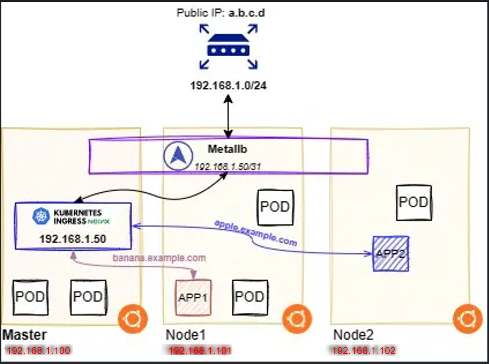

# Cài đặt Metallb + Ingress Nginx

## Giới thiệu [Metallb](https://metallb.universe.tf/concepts/) + [Ingress nginx](Cài đặt ingress.md)

MetalLB giúp Kubernetes triển khai dịch vụ LoadBalancer mà không cần nền tảng đám mây, bằng cách cấp phát địa chỉ và công bố địa chỉ ra bên ngoài.

Sau khi cài [Ingress nginx](Cài đặt ingress.md) chúng ta thấy 2 port 80/443 trên Nginx được map tương ứng sang port 32000/32748


```bash 
kubectl get services -n ingress-nginx

NAME                                 TYPE           CLUSTER-IP       EXTERNAL-IP    PORT(S)                      AGE
ingress-nginx-controller             LoadBalancer   10.103.11.172    <none>         80:32000/TCP,443:32748/TCP   17d
ingress-nginx-controller-admission   ClusterIP      10.107.107.210   <none>         443/TCP                      17d


```
Như vậy nếu muốn access vào App1 trên K8s thông qua Ingress Nginx thì cần truy cập như sau:

- **HTTP: http://app1.example.com:32000**
- **HTTPS: https://app1.example.com:32748**

Như vậy khá là bất tiện, chúng ta có thể:

- **Dùng chức năng port-forward trên router để mapping tiếp port 80->32000 và 443->32748. Về cơ bản đường đi của nó như sau: Internet (80/http) –>router (port-forward) –> Kuberentes IP (32000/http) –> Nginx (80/http)**

- **Dùng 1 Proxy như Haproxy hoặc Nginx đứng trước K8s cluster để điều phối**

Để tránh những phức tạp khi triển khai Ingress Nginx trên Bare metal K8s cluster, dưới đây mình sẽ giới thiệu cách triển khai Metallb và Ingress Nginx (Load Balancer)

Dưới đây là sơ đồ hệ thống sẽ triển khai



## Cài đặt Metallb

Nếu bạn đang sử dụng kube-proxy ở chế độ IPVS, kể từ Kubernetes v1.14.2, bạn phải bật chế độ ARP nghiêm ngặt (strict ARP mode).


!!! note "Lưu ý"

    Lưu ý, bạn không cần làm điều này nếu bạn đang sử dụng kube-router làm service-proxy, vì kube-router đã bật strict ARP theo mặc định..


Bạn có thể thực hiện điều này bằng cách chỉnh sửa cấu hình kube-proxy trong cụm hiện tại:

```bash 
kubectl edit configmap -n kube-system kube-proxy
```

Và chỉnh sửa như sau:

```bash 
apiVersion: kubeproxy.config.k8s.io/v1alpha1
kind: KubeProxyConfiguration
mode: "ipvs"
ipvs:
  strictARP: true
```

Hoặc có thể chạy bằng lệnh

```bash 
# see what changes would be made, returns nonzero returncode if different
kubectl get configmap kube-proxy -n kube-system -o yaml | \
sed -e "s/strictARP: false/strictARP: true/" | \
kubectl diff -f - -n kube-system

# actually apply the changes, returns nonzero returncode on errors only
kubectl get configmap kube-proxy -n kube-system -o yaml | \
sed -e "s/strictARP: false/strictARP: true/" | \
kubectl apply -f - -n kube-system
```

Sau đó chạy lệnh này để cài đặt

```bash 
kubectl apply -f https://raw.githubusercontent.com/metallb/metallb/v0.14.9/config/manifests/metallb-native.yaml
```

Tiếp theo, chúng ta cần config dải IP sẽ cấp phát cho Metallb, tạo file config.yaml với nội dung dưới đây:

```yaml title="config.yaml"  linenums="1"
apiVersion: metallb.io/v1beta1
kind: IPAddressPool
metadata:
  name: default-pool
  namespace: metallb-system
spec:
  addresses:
    - 192.168.1.50/32
---
apiVersion: metallb.io/v1beta1
kind: L2Advertisement
metadata:
  name: default
  namespace: metallb-system
spec:
  ipAddressPools:
    - default-pool
```

Trong trường hợp của mình, do chỉ để học tập, nghiên cứu nên mình chỉ set IP Pool có duy nhất 1 IP, Sau đó chúng ta apply thiết lập này cho Metallb

```bash 
kubectl apply -f config.yaml
```

Kiểm tra xem resouce đã được deploy thành công chưa:
```bash 
phuoctv@master:~$ kubectl get services -n ingress-nginx
NAME                                 TYPE           CLUSTER-IP       EXTERNAL-IP    PORT(S)                      AGE
ingress-nginx-controller             LoadBalancer   10.103.11.172    192.168.1.50   80:32000/TCP,443:32748/TCP   17d
ingress-nginx-controller-admission   ClusterIP      10.107.107.210   <none>         443/TCP                      17d
phuoctv@master:~$ kubectl get all -n metallb-system
NAME                             READY   STATUS    RESTARTS   AGE
pod/controller-7dcb87658-nhfqv   1/1     Running   0          18d
pod/speaker-792gx                1/1     Running   0          18d
pod/speaker-b99p7                1/1     Running   0          18d
pod/speaker-chvdv                1/1     Running   0          18d
pod/speaker-rzjhp                1/1     Running   0          6d23h
pod/speaker-wlv2f                1/1     Running   0          6d23h

NAME                              TYPE        CLUSTER-IP   EXTERNAL-IP   PORT(S)   AGE
service/metallb-webhook-service   ClusterIP   10.107.7.6   <none>        443/TCP   18d

NAME                     DESIRED   CURRENT   READY   UP-TO-DATE   AVAILABLE   NODE SELECTOR            AGE
daemonset.apps/speaker   3         3         3       3            3           kubernetes.io/os=linux   18d

NAME                         READY   UP-TO-DATE   AVAILABLE   AGE
deployment.apps/controller   1/1     1            1           18d

NAME                                   DESIRED   CURRENT   READY   AGE
replicaset.apps/controller-7dcb87658   1         1         1       18d

```

Kiểm tra xem các resouce của ingress nginx đã được triển khai chưa
```bash 
phuoctv@master:~$ kubectl get all -n ingress-nginx
NAME                                            READY   STATUS    RESTARTS   AGE
pod/ingress-nginx-controller-5486b65c4d-xn4qq   1/1     Running   0          17d

NAME                                         TYPE           CLUSTER-IP       EXTERNAL-IP    PORT(S)                      AGE
service/ingress-nginx-controller             LoadBalancer   10.103.11.172    192.168.1.50   80:32000/TCP,443:32748/TCP   17d
service/ingress-nginx-controller-admission   ClusterIP      10.107.107.210   <none>         443/TCP                      17d

NAME                                       READY   UP-TO-DATE   AVAILABLE   AGE
deployment.apps/ingress-nginx-controller   1/1     1            1           17d

NAME                                                  DESIRED   CURRENT   READY   AGE
replicaset.apps/ingress-nginx-controller-5486b65c4d   1         1         1       17d
phuoctv@master:~$

```

Như vậy chúng ta có thể thấy service/ingress-nginx-controller loại LoadBalancer đã được deploy thành công và External IP là 192.168.1.50

Tài liệu tham khảo

- [Cài đặt Metallb và Ingress Nginx trên Bare metal Kubernetes cluster của anh nvtienanh](https://nvtienanh.info/blog/cai-dat-metallb-va-ingress-nginx-tren-bare-metal-kubernetes-cluster)
- [Installation Metallb](https://metallb.universe.tf/installation/)
