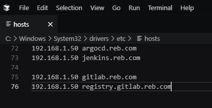
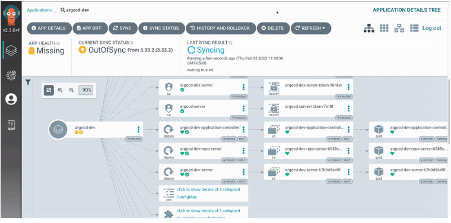

# Cài đặt Argocd

## 1. Giới thiệu Argo CD - Công cụ GitOps cho Kubernetes

**[Argo CD](https://argo-cd.readthedocs.io/en/stable/)** là công cụ **GitOps** giúp tự động triển khai và đồng bộ ứng dụng trên **Kubernetes** theo trạng thái khai báo trong Git.

[](https://argo-cd.readthedocs.io/en/stable)

Chức năng chính:

✅ **Triển khai từ Git** (YAML, Helm, Kustomize...)  
✅ **Đồng bộ trạng thái** (tự động hoặc thủ công)  
✅ **Quản lý nhiều cluster** Kubernetes  
✅ **Giao diện Web UI & CLI** trực quan  
✅ **RBAC & SSO** (quản lý quyền truy cập)  
✅ **Tích hợp CI/CD** (Jenkins, GitHub Actions...)  
✅ **Hỗ trợ Canary & [Blue-Green Deployment](https://viblo.asia/p/blue-green-deployment-tren-kubernetes-obA46P2xLKv)**  
✅ **Giám sát & cảnh báo lỗi** (Prometheus, Grafana)  

!!! tip "Tóm lại"
    Argo CD giúp quản lý Kubernetes **dễ dàng, tự động và an toàn** theo mô hình **GitOps**. 🚀


## 2. Cài đặt Argocd

```bash 
kubectl create namespace argocd
kubectl apply -n argocd -f https://raw.githubusercontent.com/argoproj/argo-cd/stable/manifests/install.yaml
```
## 3. Lấy Tài khoản cho Argocd

Tài khoản mặc định: admin

Lấy mật khẩu:
```bash 
kubectl get secret argocd-initial-admin-secret -n argocd -o jsonpath="{.data.password}" | base64 --decode

```
## 4. Tạo TLS cho Argocd

```yaml title="default-server-secret.yaml"  linenums="1"
apiVersion: v1
data:
  tls.crt: LS0tLS1CRUdJTiBDRVJUSUZJQ0FURS0tLS0tCk1JSUN2akNDQWFZQ0NRREFPRjl0THNhWFhEQU5CZ2txaGtpRzl3MEJBUXNGQURBaE1SOHdIUVlEVlFRRERCWk8KUjBsT1dFbHVaM0psYzNORGIyNTBjbTlzYkdWeU1CNFhEVEU0TURreE1qRTRNRE16TlZvWERUSXpNRGt4TVRFNApNRE16TlZvd0lURWZNQjBHQTFVRUF3d1dUa2RKVGxoSmJtZHlaWE56UTI5dWRISnZiR3hsY2pDQ0FTSXdEUVlKCktvWklodmNOQVFFQkJRQURnZ0VQQURDQ0FRb0NnZ0VCQUwvN2hIUEtFWGRMdjNyaUM3QlBrMTNpWkt5eTlyQ08KR2xZUXYyK2EzUDF0azIrS3YwVGF5aGRCbDRrcnNUcTZzZm8vWUk1Y2Vhbkw4WGM3U1pyQkVRYm9EN2REbWs1Qgo4eDZLS2xHWU5IWlg0Rm5UZ0VPaStlM2ptTFFxRlBSY1kzVnNPazFFeUZBL0JnWlJVbkNHZUtGeERSN0tQdGhyCmtqSXVuektURXUyaDU4Tlp0S21ScUJHdDEwcTNRYzhZT3ExM2FnbmovUWRjc0ZYYTJnMjB1K1lYZDdoZ3krZksKWk4vVUkxQUQ0YzZyM1lma1ZWUmVHd1lxQVp1WXN2V0RKbW1GNWRwdEMzN011cDBPRUxVTExSakZJOTZXNXIwSAo1TmdPc25NWFJNV1hYVlpiNWRxT3R0SmRtS3FhZ25TZ1JQQVpQN2MwQjFQU2FqYzZjNGZRVXpNQ0F3RUFBVEFOCkJna3Foa2lHOXcwQkFRc0ZBQU9DQVFFQWpLb2tRdGRPcEsrTzhibWVPc3lySmdJSXJycVFVY2ZOUitjb0hZVUoKdGhrYnhITFMzR3VBTWI5dm15VExPY2xxeC9aYzJPblEwMEJCLzlTb0swcitFZ1U2UlVrRWtWcitTTFA3NTdUWgozZWI4dmdPdEduMS9ienM3bzNBaS9kclkrcUI5Q2k1S3lPc3FHTG1US2xFaUtOYkcyR1ZyTWxjS0ZYQU80YTY3Cklnc1hzYktNbTQwV1U3cG9mcGltU1ZmaXFSdkV5YmN3N0NYODF6cFErUyt1eHRYK2VBZ3V0NHh3VlI5d2IyVXYKelhuZk9HbWhWNThDd1dIQnNKa0kxNXhaa2VUWXdSN0diaEFMSkZUUkk3dkhvQXprTWIzbjAxQjQyWjNrN3RXNQpJUDFmTlpIOFUvOWxiUHNoT21FRFZkdjF5ZytVRVJxbStGSis2R0oxeFJGcGZnPT0KLS0tLS1FTkQgQ0VSVElGSUNBVEUtLS0tLQo=
  tls.key: LS0tLS1CRUdJTiBSU0EgUFJJVkFURSBLRVktLS0tLQpNSUlFcEFJQkFBS0NBUUVBdi91RWM4b1JkMHUvZXVJTHNFK1RYZUprckxMMnNJNGFWaEMvYjVyYy9XMlRiNHEvClJOcktGMEdYaVN1eE9ycXgrajlnamx4NXFjdnhkenRKbXNFUkJ1Z1B0ME9hVGtIekhvb3FVWmcwZGxmZ1dkT0EKUTZMNTdlT1l0Q29VOUZ4amRXdzZUVVRJVUQ4R0JsRlNjSVo0b1hFTkhzbysyR3VTTWk2Zk1wTVM3YUhudzFtMApxWkdvRWEzWFNyZEJ6eGc2clhkcUNlUDlCMXl3VmRyYURiUzc1aGQzdUdETDU4cGszOVFqVUFQaHpxdmRoK1JWClZGNGJCaW9CbTVpeTlZTW1hWVhsMm0wTGZzeTZuUTRRdFFzdEdNVWozcGJtdlFmazJBNnljeGRFeFpkZFZsdmwKMm82MjBsMllxcHFDZEtCRThCay90elFIVTlKcU56cHpoOUJUTXdJREFRQUJBb0lCQVFDZklHbXowOHhRVmorNwpLZnZJUXQwQ0YzR2MxNld6eDhVNml4MHg4Mm15d1kxUUNlL3BzWE9LZlRxT1h1SENyUlp5TnUvZ2IvUUQ4bUFOCmxOMjRZTWl0TWRJODg5TEZoTkp3QU5OODJDeTczckM5bzVvUDlkazAvYzRIbjAzSkVYNzZ5QjgzQm9rR1FvYksKMjhMNk0rdHUzUmFqNjd6Vmc2d2szaEhrU0pXSzBwV1YrSjdrUkRWYmhDYUZhNk5nMUZNRWxhTlozVDhhUUtyQgpDUDNDeEFTdjYxWTk5TEI4KzNXWVFIK3NYaTVGM01pYVNBZ1BkQUk3WEh1dXFET1lvMU5PL0JoSGt1aVg2QnRtCnorNTZud2pZMy8yUytSRmNBc3JMTnIwMDJZZi9oY0IraVlDNzVWYmcydVd6WTY3TWdOTGQ5VW9RU3BDRkYrVm4KM0cyUnhybnhBb0dCQU40U3M0ZVlPU2huMVpQQjdhTUZsY0k2RHR2S2ErTGZTTXFyY2pOZjJlSEpZNnhubmxKdgpGenpGL2RiVWVTbWxSekR0WkdlcXZXaHFISy9iTjIyeWJhOU1WMDlRQ0JFTk5jNmtWajJTVHpUWkJVbEx4QzYrCk93Z0wyZHhKendWelU0VC84ajdHalRUN05BZVpFS2FvRHFyRG5BYWkyaW5oZU1JVWZHRXFGKzJyQW9HQkFOMVAKK0tZL0lsS3RWRzRKSklQNzBjUis3RmpyeXJpY05iWCtQVzUvOXFHaWxnY2grZ3l4b25BWlBpd2NpeDN3QVpGdwpaZC96ZFB2aTBkWEppc1BSZjRMazg5b2pCUmpiRmRmc2l5UmJYbyt3TFU4NUhRU2NGMnN5aUFPaTVBRHdVU0FkCm45YWFweUNweEFkREtERHdObit3ZFhtaTZ0OHRpSFRkK3RoVDhkaVpBb0dCQUt6Wis1bG9OOTBtYlF4VVh5YUwKMjFSUm9tMGJjcndsTmVCaWNFSmlzaEhYa2xpSVVxZ3hSZklNM2hhUVRUcklKZENFaHFsV01aV0xPb2I2NTNyZgo3aFlMSXM1ZUtka3o0aFRVdnpldm9TMHVXcm9CV2xOVHlGanIrSWhKZnZUc0hpOGdsU3FkbXgySkJhZUFVWUNXCndNdlQ4NmNLclNyNkQrZG8wS05FZzFsL0FvR0FlMkFVdHVFbFNqLzBmRzgrV3hHc1RFV1JqclRNUzRSUjhRWXQKeXdjdFA4aDZxTGxKUTRCWGxQU05rMXZLTmtOUkxIb2pZT2pCQTViYjhibXNVU1BlV09NNENoaFJ4QnlHbmR2eAphYkJDRkFwY0IvbEg4d1R0alVZYlN5T294ZGt5OEp0ek90ajJhS0FiZHd6NlArWDZDODhjZmxYVFo5MWpYL3RMCjF3TmRKS2tDZ1lCbyt0UzB5TzJ2SWFmK2UwSkN5TGhzVDQ5cTN3Zis2QWVqWGx2WDJ1VnRYejN5QTZnbXo5aCsKcDNlK2JMRUxwb3B0WFhNdUFRR0xhUkcrYlNNcjR5dERYbE5ZSndUeThXczNKY3dlSTdqZVp2b0ZpbmNvVlVIMwphdmxoTUVCRGYxSjltSDB5cDBwWUNaS2ROdHNvZEZtQktzVEtQMjJhTmtsVVhCS3gyZzR6cFE9PQotLS0tLUVORCBSU0EgUFJJVkFURSBLRVktLS0tLQo=
kind: Secret
metadata:
  annotations:
    kubectl.kubernetes.io/last-applied-configuration: |
      {"apiVersion":"v1","data":{"tls.crt":"LS0tLS1CRUdJTiBDRVJUSUZJQ0FURS0tLS0tCk1JSUN2akNDQWFZQ0NRREFPRjl0THNhWFhEQU5CZ2txaGtpRzl3MEJBUXNGQURBaE1SOHdIUVlEVlFRRERCWk8KUjBsT1dFbHVaM0psYzNORGIyNTBjbTlzYkdWeU1CNFhEVEU0TURreE1qRTRNRE16TlZvWERUSXpNRGt4TVRFNApNRE16TlZvd0lURWZNQjBHQTFVRUF3d1dUa2RKVGxoSmJtZHlaWE56UTI5dWRISnZiR3hsY2pDQ0FTSXdEUVlKCktvWklodmNOQVFFQkJRQURnZ0VQQURDQ0FRb0NnZ0VCQUwvN2hIUEtFWGRMdjNyaUM3QlBrMTNpWkt5eTlyQ08KR2xZUXYyK2EzUDF0azIrS3YwVGF5aGRCbDRrcnNUcTZzZm8vWUk1Y2Vhbkw4WGM3U1pyQkVRYm9EN2REbWs1Qgo4eDZLS2xHWU5IWlg0Rm5UZ0VPaStlM2ptTFFxRlBSY1kzVnNPazFFeUZBL0JnWlJVbkNHZUtGeERSN0tQdGhyCmtqSXVuektURXUyaDU4Tlp0S21ScUJHdDEwcTNRYzhZT3ExM2FnbmovUWRjc0ZYYTJnMjB1K1lYZDdoZ3krZksKWk4vVUkxQUQ0YzZyM1lma1ZWUmVHd1lxQVp1WXN2V0RKbW1GNWRwdEMzN011cDBPRUxVTExSakZJOTZXNXIwSAo1TmdPc25NWFJNV1hYVlpiNWRxT3R0SmRtS3FhZ25TZ1JQQVpQN2MwQjFQU2FqYzZjNGZRVXpNQ0F3RUFBVEFOCkJna3Foa2lHOXcwQkFRc0ZBQU9DQVFFQWpLb2tRdGRPcEsrTzhibWVPc3lySmdJSXJycVFVY2ZOUitjb0hZVUoKdGhrYnhITFMzR3VBTWI5dm15VExPY2xxeC9aYzJPblEwMEJCLzlTb0swcitFZ1U2UlVrRWtWcitTTFA3NTdUWgozZWI4dmdPdEduMS9ienM3bzNBaS9kclkrcUI5Q2k1S3lPc3FHTG1US2xFaUtOYkcyR1ZyTWxjS0ZYQU80YTY3Cklnc1hzYktNbTQwV1U3cG9mcGltU1ZmaXFSdkV5YmN3N0NYODF6cFErUyt1eHRYK2VBZ3V0NHh3VlI5d2IyVXYKelhuZk9HbWhWNThDd1dIQnNKa0kxNXhaa2VUWXdSN0diaEFMSkZUUkk3dkhvQXprTWIzbjAxQjQyWjNrN3RXNQpJUDFmTlpIOFUvOWxiUHNoT21FRFZkdjF5ZytVRVJxbStGSis2R0oxeFJGcGZnPT0KLS0tLS1FTkQgQ0VSVElGSUNBVEUtLS0tLQo=","tls.key":"LS0tLS1CRUdJTiBSU0EgUFJJVkFURSBLRVktLS0tLQpNSUlFcEFJQkFBS0NBUUVBdi91RWM4b1JkMHUvZXVJTHNFK1RYZUprckxMMnNJNGFWaEMvYjVyYy9XMlRiNHEvClJOcktGMEdYaVN1eE9ycXgrajlnamx4NXFjdnhkenRKbXNFUkJ1Z1B0ME9hVGtIekhvb3FVWmcwZGxmZ1dkT0EKUTZMNTdlT1l0Q29VOUZ4amRXdzZUVVRJVUQ4R0JsRlNjSVo0b1hFTkhzbysyR3VTTWk2Zk1wTVM3YUhudzFtMApxWkdvRWEzWFNyZEJ6eGc2clhkcUNlUDlCMXl3VmRyYURiUzc1aGQzdUdETDU4cGszOVFqVUFQaHpxdmRoK1JWClZGNGJCaW9CbTVpeTlZTW1hWVhsMm0wTGZzeTZuUTRRdFFzdEdNVWozcGJtdlFmazJBNnljeGRFeFpkZFZsdmwKMm82MjBsMllxcHFDZEtCRThCay90elFIVTlKcU56cHpoOUJUTXdJREFRQUJBb0lCQVFDZklHbXowOHhRVmorNwpLZnZJUXQwQ0YzR2MxNld6eDhVNml4MHg4Mm15d1kxUUNlL3BzWE9LZlRxT1h1SENyUlp5TnUvZ2IvUUQ4bUFOCmxOMjRZTWl0TWRJODg5TEZoTkp3QU5OODJDeTczckM5bzVvUDlkazAvYzRIbjAzSkVYNzZ5QjgzQm9rR1FvYksKMjhMNk0rdHUzUmFqNjd6Vmc2d2szaEhrU0pXSzBwV1YrSjdrUkRWYmhDYUZhNk5nMUZNRWxhTlozVDhhUUtyQgpDUDNDeEFTdjYxWTk5TEI4KzNXWVFIK3NYaTVGM01pYVNBZ1BkQUk3WEh1dXFET1lvMU5PL0JoSGt1aVg2QnRtCnorNTZud2pZMy8yUytSRmNBc3JMTnIwMDJZZi9oY0IraVlDNzVWYmcydVd6WTY3TWdOTGQ5VW9RU3BDRkYrVm4KM0cyUnhybnhBb0dCQU40U3M0ZVlPU2huMVpQQjdhTUZsY0k2RHR2S2ErTGZTTXFyY2pOZjJlSEpZNnhubmxKdgpGenpGL2RiVWVTbWxSekR0WkdlcXZXaHFISy9iTjIyeWJhOU1WMDlRQ0JFTk5jNmtWajJTVHpUWkJVbEx4QzYrCk93Z0wyZHhKendWelU0VC84ajdHalRUN05BZVpFS2FvRHFyRG5BYWkyaW5oZU1JVWZHRXFGKzJyQW9HQkFOMVAKK0tZL0lsS3RWRzRKSklQNzBjUis3RmpyeXJpY05iWCtQVzUvOXFHaWxnY2grZ3l4b25BWlBpd2NpeDN3QVpGdwpaZC96ZFB2aTBkWEppc1BSZjRMazg5b2pCUmpiRmRmc2l5UmJYbyt3TFU4NUhRU2NGMnN5aUFPaTVBRHdVU0FkCm45YWFweUNweEFkREtERHdObit3ZFhtaTZ0OHRpSFRkK3RoVDhkaVpBb0dCQUt6Wis1bG9OOTBtYlF4VVh5YUwKMjFSUm9tMGJjcndsTmVCaWNFSmlzaEhYa2xpSVVxZ3hSZklNM2hhUVRUcklKZENFaHFsV01aV0xPb2I2NTNyZgo3aFlMSXM1ZUtka3o0aFRVdnpldm9TMHVXcm9CV2xOVHlGanIrSWhKZnZUc0hpOGdsU3FkbXgySkJhZUFVWUNXCndNdlQ4NmNLclNyNkQrZG8wS05FZzFsL0FvR0FlMkFVdHVFbFNqLzBmRzgrV3hHc1RFV1JqclRNUzRSUjhRWXQKeXdjdFA4aDZxTGxKUTRCWGxQU05rMXZLTmtOUkxIb2pZT2pCQTViYjhibXNVU1BlV09NNENoaFJ4QnlHbmR2eAphYkJDRkFwY0IvbEg4d1R0alVZYlN5T294ZGt5OEp0ek90ajJhS0FiZHd6NlArWDZDODhjZmxYVFo5MWpYL3RMCjF3TmRKS2tDZ1lCbyt0UzB5TzJ2SWFmK2UwSkN5TGhzVDQ5cTN3Zis2QWVqWGx2WDJ1VnRYejN5QTZnbXo5aCsKcDNlK2JMRUxwb3B0WFhNdUFRR0xhUkcrYlNNcjR5dERYbE5ZSndUeThXczNKY3dlSTdqZVp2b0ZpbmNvVlVIMwphdmxoTUVCRGYxSjltSDB5cDBwWUNaS2ROdHNvZEZtQktzVEtQMjJhTmtsVVhCS3gyZzR6cFE9PQotLS0tLUVORCBSU0EgUFJJVkFURSBLRVktLS0tLQo="},"kind":"Secret","metadata":{"annotations":{},"name":"default-server-secret","namespace":"nginx-ingress"},"type":"kubernetes.io/tls"}
  creationTimestamp: "2024-10-17T14:15:43Z"
  name: default-server-secret-argocd
  namespace: argocd
  resourceVersion: "4954"
  uid: 6913f795-8c2e-44eb-a822-bf519f2508bb
type: kubernetes.io/tls

```

!!! note "Lưu ý"

    Lưu ý, bạn có thể thay tls khác của bạn


## 5. Tạo Ingress cho Argocd

```yaml title="ingress.yaml"  linenums="1"
apiVersion: networking.k8s.io/v1
kind: Ingress
metadata:
  name: app
  namespace: argocd
  annotations:
    kubernetes.io/ingress.class: "nginx"
    nginx.ingress.kubernetes.io/force-ssl-redirect: "true"
    nginx.ingress.kubernetes.io/backend-protocol: "HTTPS"
spec:
  ingressClassName: nginx
  tls:
    - hosts:
      - argocd.reb.com
      secretName: default-server-secret-argocd
  rules:
  - host: argocd.reb.com
    http:
      paths:
      - path: /
        pathType: Prefix
        backend:
          service:
            name: argocd-server
            port:
              number: 80
```

## 8. Trỏ host đến domain của Argocd ở máy truy cập

Nếu sử dụng window thì có thể vào C:\Windows\System32\drivers\etc\hosts thêm dòng:

```bash 
192.168.1.50 argocd.reb.com
```

Và lưu với quyền admin




!!! note "Lưu ý"

    Lưu ý, 192.168.1.50 là [External IP của ingress của bài viết trước](Cài đặt Metallb.md)


## 9. Video giới thiệu
[](https://youtu.be/aWDIQMbp1cc?t=1m4s)


Tài liệu tham khảo

- [Argo CD - Declarative GitOps CD for Kubernetes](https://argo-cd.readthedocs.io/en/stable/)
