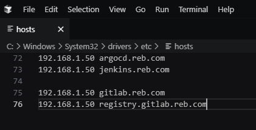

# Cài đặt Jenkins trên K8S

## 1. Giới thiệu

[Jenkins](https://www.jenkins.io/doc/book/getting-started/) là một công cụ CI/CD mã nguồn mở phổ biến, giúp tự động hóa quá trình build, test và deploy ứng dụng. Việc triển khai Jenkins trên Kubernetes giúp tận dụng khả năng mở rộng, tự động hóa và quản lý tài nguyên linh hoạt của K8S.

## 2. Cài đặt jenkins

### 2.1. Tạo namespace cho jenkins

```bash 
kubectl create namespace devops-tools
```

### 2.2. Tạo PV & PVC cho jenkins
Trong bài viết này mình dùng NFS để làm nơi lưu trữ dữ liệu của jenkins


```yaml title="volume.yaml"  linenums="1"
apiVersion: v1
kind: PersistentVolume
metadata:
  name: jenkins-pv
  namespace: devops-tools
spec:
  capacity:
    storage: 20Gi
  accessModes:
    - ReadWriteMany
  persistentVolumeReclaimPolicy: Retain
  storageClassName: manual
  nfs:
    path: /mnt/nfs_share/jenkins
    server: 192.168.1.110  # Thay bằng IP NFS Server
    readOnly: false
---

apiVersion: v1
kind: PersistentVolumeClaim
metadata:
  name: jenkins-pvc
  namespace: devops-tools
spec:
  accessModes:
    - ReadWriteMany
  resources:
    requests:
      storage: 20Gi
  storageClassName: manual

```


### 2.3. Cấp quyền cho jenkins


```yaml title="jenkins-01-serviceAccount.yaml"  linenums="1"
---
apiVersion: rbac.authorization.k8s.io/v1
kind: ClusterRole
metadata:
  name: jenkins-admin
rules:
  - apiGroups: [""]
    resources: ["*"]
    verbs: ["*"]
---
apiVersion: v1
kind: ServiceAccount
metadata:
  name: jenkins-admin
  namespace: devops-tools
---
apiVersion: rbac.authorization.k8s.io/v1
kind: ClusterRoleBinding
metadata:
  name: jenkins-admin
roleRef:
  apiGroup: rbac.authorization.k8s.io
  kind: ClusterRole
  name: jenkins-admin
subjects:
- kind: ServiceAccount
  name: jenkins-admin
  namespace: devops-tools

```


### 2.4. Tạo Deployment & Service cho jenkins


```yaml title="deployment.yaml"  linenums="1"
apiVersion: apps/v1
kind: Deployment
metadata:
  name: jenkins
  namespace: devops-tools
spec:
  replicas: 1
  selector:
    matchLabels:
      app: jenkins
  template:
    metadata:
      labels:
        app: jenkins
    spec:
      containers:
      - name: jenkins
        image: jenkins/jenkins:lts
        ports:
        - containerPort: 8080
        - containerPort: 50000
        volumeMounts:
        - name: jenkins-storage
          mountPath: /var/jenkins_home
      volumes:
      - name: jenkins-storage
        persistentVolumeClaim:
          claimName: jenkins-pvc
---
apiVersion: v1
kind: Service
metadata:
  name: jenkins-service
  namespace: devops-tools
spec:
  selector:
    app: jenkins
  ports:
    - name: http
      protocol: TCP
      port: 8080
      targetPort: 8080
    - name: agent
      protocol: TCP
      port: 50000
      targetPort: 50000
  type: ClusterIP

```

### 2.5. Tạo Ingress cho jenkins


```yaml title="ingress.yaml"  linenums="1"
apiVersion: networking.k8s.io/v1
kind: Ingress
metadata:
  name: jenkins-ingress
  namespace: devops-tools
  annotations:
    nginx.ingress.kubernetes.io/rewrite-target: /
spec:
  ingressClassName: nginx
  rules:
  - host: jenkins.reb.com  # Đổi thành domain của bạn
    http:
      paths:
      - path: /
        pathType: Prefix
        backend:
          service:
            name: jenkins-service
            port:
              number: 8080
```

### 2.6. Trỏ host đến domain của Jenkins ở máy truy cập

Nếu sử dụng window thì có thể vào C:\Windows\System32\drivers\etc\hosts thêm dòng:

```bash 
192.168.1.50 jenkins.reb.com
```

Và lưu với quyền admin




## 3. Mở khóa Jenkins
Khi lần đầu vào jenkins, bạn sẽ bị yêu cầu mở khóa jenkins


Lấy mật khẩu như sau:

```bash 
kubectl logs $(kubectl get pods --selector=app=jenkins -o jsonpath="{.items[0].metadata.name}") | grep "Please use the following password"

```

hoặc lấy từ log của pod jenkins

```bash 
kubectl get pods -n devops-tools
```

```bash 
kubectl logs jenkins-8497b4465d-lg9g6 -n devops-tools


*************************************************************
*************************************************************
*************************************************************

Jenkins initial setup is required.
An admin user has been created and a password generated.
Please use the following password to proceed to installation:

94b73ef6578c4b4692a157f768b2cfef

This may also be found at:
/var/jenkins_home/secrets/initialAdminPassword

*************************************************************
*************************************************************
*************************************************************
```
