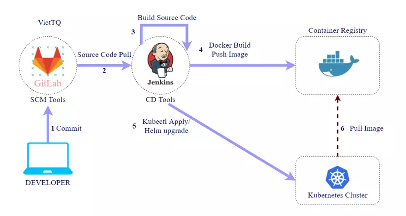

# GitOps: Jenkins + Argocd + Github + Docker hub

## 1. Giới thiệu
GitOps là một phương pháp triển khai và quản lý hạ tầng, ứng dụng dựa trên Git. Nó sử dụng các công cụ CI/CD để tự động hóa việc triển khai và đồng bộ hệ thống với trạng thái mong muốn được lưu trữ trong Git repository

## 2. Chức năng các công cụ trong GitOps

### 2.1. GitHub
- **Chức năng**: Lưu trữ mã nguồn và cấu hình Kubernetes (manifests, Helm charts).
- **Vai trò**: GitHub là nơi chứa cấu hình và tài nguyên ứng dụng.

### 2.2. Jenkins
- **Chức năng**: Tự động hóa quy trình build và deploy.
- **Vai trò**: Jenkins xây dựng ứng dụng, tạo Image Docker và đẩy lên Docker Hub.

### 2.3. Docker Hub
- **Chức năng**: Lưu trữ Image Docker.
- **Vai trò**: Docker Hub là nơi lưu trữ Image Docker sẵn sàng để triển khai.

### 2.3. ArgoCD
- **Chức năng**: Triển khai và quản lý ứng dụng trên Kubernetes.
- **Vai trò**: ArgoCD đồng bộ hóa trạng thái ứng dụng trong Kubernetes với cấu hình trong Git.

## 3. Quy trình GitOps

-   Source code của dự án được lưu ở một repo riêng, gọi là source repo
-   Phần cấu hình triển khai ứng dụng (helmchart hay k8s manifest files..) được lưu ở một repo riêng, gọi là config repo
-   Luồng CICD hoạt động theo trình tự:
    -   Dev commit source code
    -   Jenkins build source code
    -   Jenkins Build Images
    -   Jenkins push image lên image registry
    -   Jenkins cập nhật thông tin phiên bản ứng dụng vào các file cấu hình triển khai ứng dụng lưu trên config repo
    -   ArgoCD phát hiện thay đổi trên config repo thì cập nhật thay đổi về
    -   ArgoCD so sánh thông tin cấu hình mới với cấu hình hiện tại trên hệ thống, nếu phát hiện sai khác sẽ cảnh báo và đồng bộ lại theo cấu hình được khai báo và lưu trên config repo

!!! tip "Chú ý"
    Có thể thay [GitHub](https://github.com/) bằng [Gitlab](https://docs.gitlab.com/user/get_started/) và Docker Hub bằng [Harbor registry private](https://goharbor.io/) hoặc [Gitlab registry](https://docs.gitlab.com/user/packages/container_registry/) để sử dụng registry riêng (private).

