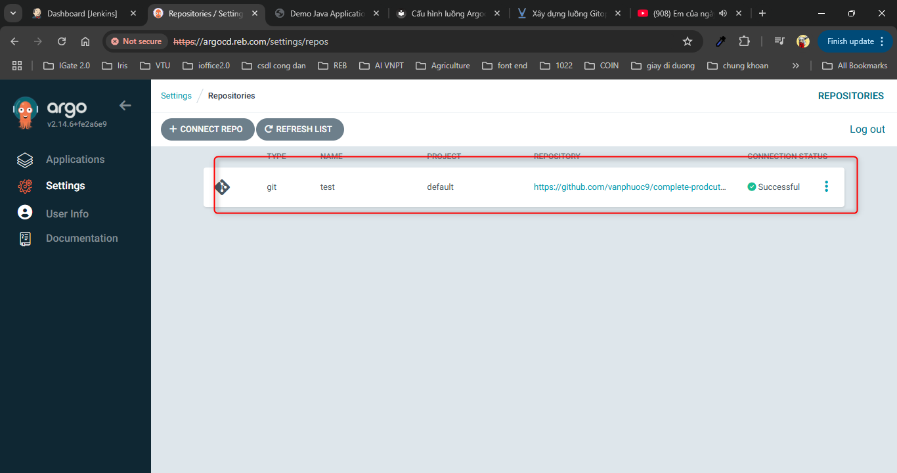
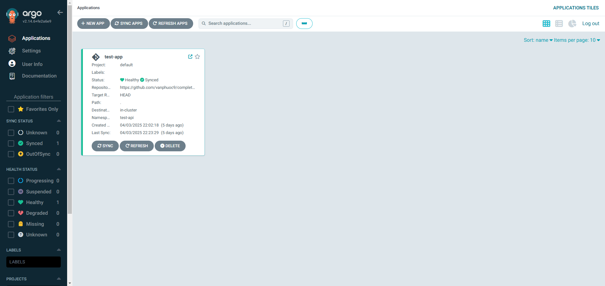
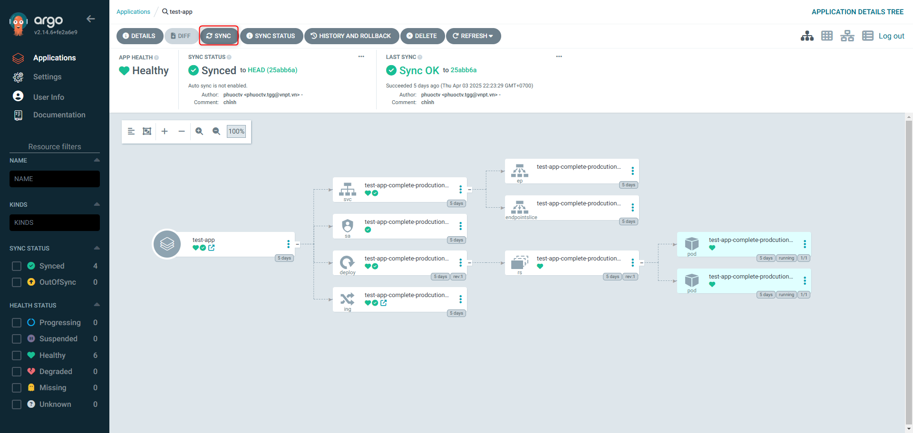
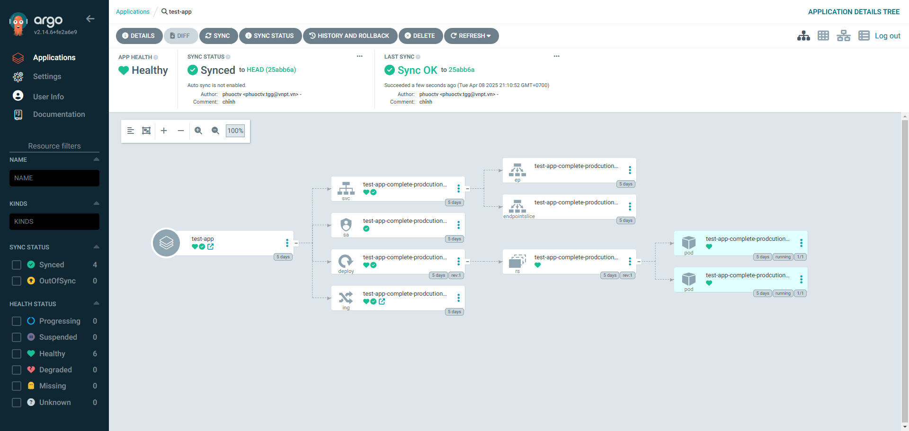
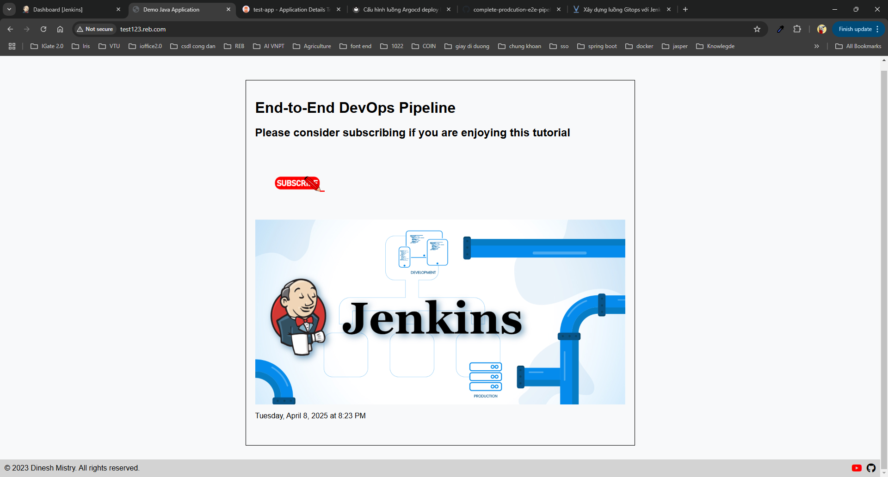

# Cấu hình luồng Argocd deploy lên k8s

## 1. Giới thiệu

Trong bài viết trước Jenkins đã lấy source từ github sau đó dùng kaniko để build Dockerfile có trong source, sau đó đẩy image lên docker hub, bài viết này mình sẽ giới thiệu luồng kế tiếp argocd dùng image của trên docker hub để deployment ứng dụng lên k8s

Config repo: là nơi chứa cấu hình để deployment ứng dụng lên k8s

Config repo source trong ví dụ: [https://github.com/vanphuoc9/complete-prodcution-e2e-pipeline-config](https://github.com/vanphuoc9/complete-prodcution-e2e-pipeline-config)


## 2. Dùng helm để deployment ứng dụng lên k8s bằng argocd

### 2.1. Tạo dự án helm

```bash 
helm create complete-prodcution-e2e-pipeline-config
```

!!! note "Chưa cài helm thì cài"
    https://github.com/helm/helm/releases


Sửa file values.yaml của project helm complete-prodcution-e2e-pipeline-config các dòng sau

```yaml title="values.yaml" linenums="1"  hl_lines="6 10 14 57 61 67"
# Default values for complete-prodcution-e2e-pipeline-config.
# This is a YAML-formatted file.
# Declare variables to be passed into your templates.

# This will set the replicaset count more information can be found here: https://kubernetes.io/docs/concepts/workloads/controllers/replicaset/
replicaCount: 2

# This sets the container image more information can be found here: https://kubernetes.io/docs/concepts/containers/images/
image:
  repository: thaiphuoc1997/testk8s
  # This sets the pull policy for images.
  pullPolicy: IfNotPresent
  # Overrides the image tag whose default is the chart appVersion.
  tag: "latest"

# This is for the secretes for pulling an image from a private repository more information can be found here: https://kubernetes.io/docs/tasks/configure-pod-container/pull-image-private-registry/
imagePullSecrets: []
# This is to override the chart name.
nameOverride: ""
fullnameOverride: ""

#This section builds out the service account more information can be found here: https://kubernetes.io/docs/concepts/security/service-accounts/
serviceAccount:
  # Specifies whether a service account should be created
  create: true
  # Automatically mount a ServiceAccount's API credentials?
  automount: true
  # Annotations to add to the service account
  annotations: {}
  # The name of the service account to use.
  # If not set and create is true, a name is generated using the fullname template
  name: ""

# This is for setting Kubernetes Annotations to a Pod.
# For more information checkout: https://kubernetes.io/docs/concepts/overview/working-with-objects/annotations/ 
podAnnotations: {}
# This is for setting Kubernetes Labels to a Pod.
# For more information checkout: https://kubernetes.io/docs/concepts/overview/working-with-objects/labels/
podLabels: {}

podSecurityContext: {}
  # fsGroup: 2000

securityContext: {}
  # capabilities:
  #   drop:
  #   - ALL
  # readOnlyRootFilesystem: true
  # runAsNonRoot: true
  # runAsUser: 1000

# This is for setting up a service more information can be found here: https://kubernetes.io/docs/concepts/services-networking/service/
service:
  # This sets the service type more information can be found here: https://kubernetes.io/docs/concepts/services-networking/service/#publishing-services-service-types
  type: ClusterIP
  # This sets the ports more information can be found here: https://kubernetes.io/docs/concepts/services-networking/service/#field-spec-ports
  port: 8080

# This block is for setting up the ingress for more information can be found here: https://kubernetes.io/docs/concepts/services-networking/ingress/
ingress:
  enabled: true
  className: ""
  annotations: {}
    # kubernetes.io/ingress.class: nginx
    # kubernetes.io/tls-acme: "true"
  hosts:
    - host: test.reb.com
      paths:
        - path: /
          pathType: ImplementationSpecific
  tls: []
  #  - secretName: chart-example-tls
  #    hosts:
  #      - chart-example.local

resources: {}
  # We usually recommend not to specify default resources and to leave this as a conscious
  # choice for the user. This also increases chances charts run on environments with little
  # resources, such as Minikube. If you do want to specify resources, uncomment the following
  # lines, adjust them as necessary, and remove the curly braces after 'resources:'.
  # limits:
  #   cpu: 100m
  #   memory: 128Mi
  # requests:
  #   cpu: 100m
  #   memory: 128Mi

# This is to setup the liveness and readiness probes more information can be found here: https://kubernetes.io/docs/tasks/configure-pod-container/configure-liveness-readiness-startup-probes/
livenessProbe:
  httpGet:
    path: /
    port: http
readinessProbe:
  httpGet:
    path: /
    port: http

#This section is for setting up autoscaling more information can be found here: https://kubernetes.io/docs/concepts/workloads/autoscaling/
autoscaling:
  enabled: false
  minReplicas: 1
  maxReplicas: 10
  targetCPUUtilizationPercentage: 80
  # targetMemoryUtilizationPercentage: 80

# Additional volumes on the output Deployment definition.
volumes: []
# - name: foo
#   secret:
#     secretName: mysecret
#     optional: false

# Additional volumeMounts on the output Deployment definition.
volumeMounts: []
# - name: foo
#   mountPath: "/etc/foo"
#   readOnly: true

nodeSelector: {}

tolerations: []

affinity: {}

```

### 2.2. Tạo access key để truy cập github

Vào thông tin user ở góc trên bên phải chọn Setting ⇒ Developer settings (Hoặc truy cập thẳng vào link: [https://github.com/settings/tokens](https://github.com/settings/tokens))

Chọn Generate new token ⇒ Generate new token (classic) ⇒ Đặt tên token và tick chọn vào mục repo ⇒ Generate token ⇒ Lưu lại token vừa sinh ra để sử dụng

### 2.3. Khai báo repository chứa config repo vào argocd

Từ web của argocd vào Settings → Repositories → Connect repo → via HTTPS và cấu hình các tham số như sau:

- Choose your connection method: => VIA HTTPS
- Type => Git
- Project => default
- Repository URL: Điền thông tin repo đã tạo ở bên trên  [https://github.com/vanphuoc9/complete-prodcution-e2e-pipeline-config](https://github.com/vanphuoc9/complete-prodcution-e2e-pipeline-config)
- Username/Password: Điền thông tin account, password là token tạo bên trên.



### 2.4. Khai báo ứng dụng trên ArgoCD

Khai báo application: Từ web của argocd vào Applications → New App và điền các tham số như sau:

GENERAL:

- Application Name: Điền tên của Application, ví dụ test-api
- Project Name: Default
- SYNC POLICY: Manual. Ở đây có 2 option là Manual hoặc Auto-sync


!!! tip "Chú ý"
    - Auto-sync: Khi phát hiện sự bất đồng bộ giữa cấu hình thực tế (trên K8S) so với định nghĩa (trên config repo thì Argo thực hiện tự động việc cập nhật cấu hình các resource trên K8S theo đúng cấu hình đã định nghĩa
    - Manual Khi phát hiện bất động bộ thì ArgoCD sẽ chỉ cảnh báo lên các resource bị mất đồng bộ (out of sync) và bạn muốn đồng bộ lại thì cần phải chọn vào nút sync để đồng bộ lại.

SOURCE:

- Repository URL: [https://github.com/vanphuoc9/complete-prodcution-e2e-pipeline-config](https://github.com/vanphuoc9/complete-prodcution-e2e-pipeline-config)
- Path: . -> Đây là thư mục chứa helmchart của chúng ta

DESTINATION:

- Cluster URL: https://kubernetes.default.svc
- Namespace: test-api

!!! tip "Chú ý"

    Namespace: test-api cần tạo trước

Helm:

VALUES FILES: chọn values.yaml




Có thể chạy argocd-test-config.yaml bên dưới thay vì cấu hình bằng giao diện ở trên

```yaml title="argocd-test-config.yaml"  linenums="1"
project: default
source:
  repoURL: https://github.com/vanphuoc9/complete-prodcution-e2e-pipeline-config.git
  path: .
  targetRevision: HEAD
  helm:
    valueFiles:
      - values.yaml
destination:
  server: https://kubernetes.default.svc
  namespace: test-api
```

```bash 
kubectl apply -f argocd-test-config.yaml
  
```

Chúng ta có thể ấn SYNC để đồng bộ trạng thái trên k8s với trên git



Kết quả sau khi sync thành công, ứng dụng ở trạng thái "Synced":



### 2.5. Trỏ host đến domain của App test ở máy truy cập

Nếu sử dụng window thì có thể vào C:\Windows\System32\drivers\etc\hosts thêm dòng:

```bash 
192.168.1.50 test123.reb.com
  
```

### 2.6. Test gọi đường dẫn test123.reb.com sẽ thấy trang web test hiện lên như sau



## 3. Tài liệu tham khảo

- [Xây dựng luồng Gitops với Jenkins và ArgoCD](https://viblo.asia/p/k8s-phan-21-xay-dung-luong-gitops-voi-jenkins-va-argocd-y3RL1aX7Lao#_tao-access-key-de-truy-cap-github-15)