# Cấu hình luồng Jenkins Build Docker image và push lên Docker Hub

## 1. Giới thiệu

Trong bài viết này chúng ta sẽ cùng nhau tìm hiểu cách build docker image trên con Jenkins này bằng công cụ Kaniko.

### 1.1. **Run Docker in a Docker Container**

Như chúng ta đã biết, thì bản chất của việc deploy Jenkins trên cụm Kubernetes là chúng ta chạy Jenkins master ở dang 1 docker container (pod) và các Agent sẽ được tạo khi các pipeline chay. Agent chính là docker container được đóng gói trong pod.

Như vậy nếu Pipeline của chúng ta chạy task build docker image chẳng hạn, thì sẽ phát sinh ra vấn đề docker container có thể chạy được các lệnh docker để làm nhiệm vụ build docker image khác.

### 1.2. **Kaniko**

Kaniko là một công cụ mã nguồn mở dùng để xây dựng các image Docker từ một Dockerfile mà không cần sử dụng daemon Docker. Kaniko có thể chạy trên bất kỳ nền tảng nào hỗ trợ container, như Kubernetes, Google Cloud Build, Tekton, Jenkins, GitLab và nhiều hơn nữa. Kaniko giải quyết vấn đề về bảo mật và hiệu suất khi xây dựng các image Docker trên môi trường của container.

!!! note "Một số tính năng chính của Kaniko"

    - Hỗ trợ xây dựng các image Docker từ các nguồn khác nhau, như local directory, Git repository, Google Cloud Storage, Amazon S3, v.v. 
    - Hỗ trợ đẩy các image Docker lên các kho lưu trữ khác nhau, như Docker Hub, Google Container Registry, Amazon Elastic Container Registry, v.v.
    - Hỗ trợ sử dụng các biến môi trường, các tham số build-time và các file cấu hình để tùy biến quá trình xây dựng image
    - Hỗ trợ sử dụng cache để tăng tốc độ xây dựng image và giảm dung lượng image
    - Hỗ trợ xây dựng các image đa tầng (multi-stage) và kế thừa từ các image khác
    - Hỗ trợ kiểm tra tính hợp lệ của Dockerfile và thông báo lỗi nếu có

## 2. Cấu hình cài đặt 

### 2.1. Cài plugins trên jenkins

Vào Dashboard > Manage > Jenkins > Plugins

Cài các plugin sau:

- Kubernetes plugin
- Docker plugin

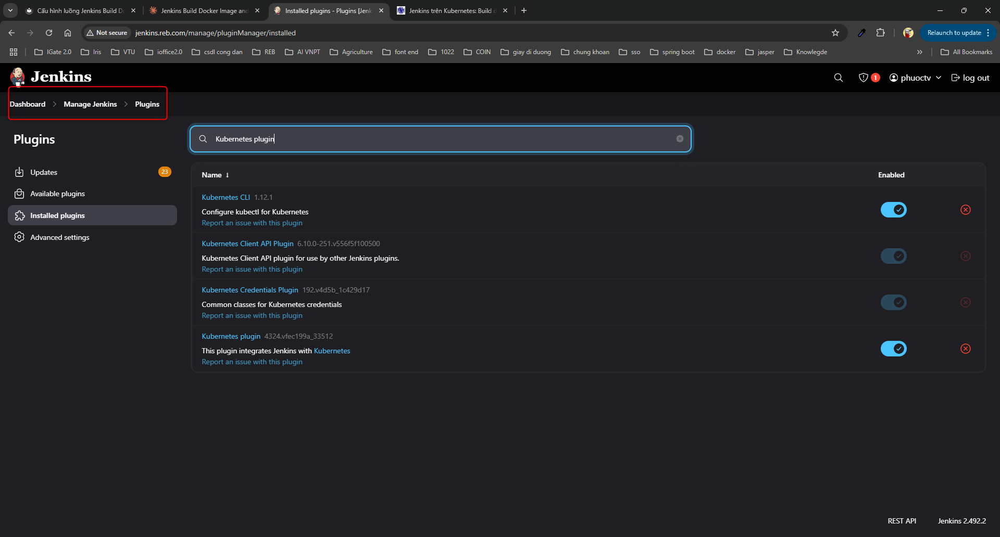

### 2.2. Cấu hình clouds ở jenkins

Vào Dashboard > Manage Jenkins > Clouds

Nếu chưa có Clouds, thì chọn "New cloud" để thêm mới

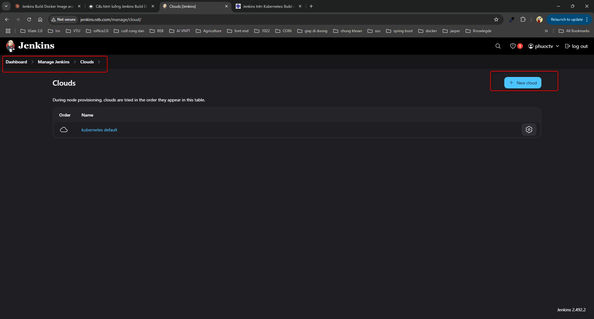

Ví dụ tên "kubernetes default" và chọn type "Kubernetes"

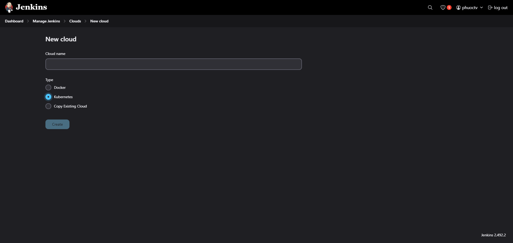

Tiếp tục vào Dashboard > Manage Jenkins > Clouds > kubernetes default > Configure

Cấu hình các tham số sau:

- **Name**: kubernetes default
- **Kubernetes URL**: https://kubernetes.default.svc
- **Kubernetes Namespace**: devops-tools
- **Jenkins URL**: http://jenkins-service:8080

!!! note "Trong đó"

    - Name là tên
    - Kubernetes URL: là đường dẫn của Kubernetes
    - Kubernetes Namespace: là namespace của jenkins được cài đặt
    - Jenkins URL: là đường dẫn của service jenkins được cài ở file deployment.yaml ở bài viết [cài jenkins](../Cài đặt K8S/Cài đặt jenkins.md) (The URL of the Jenkins Controller server.)

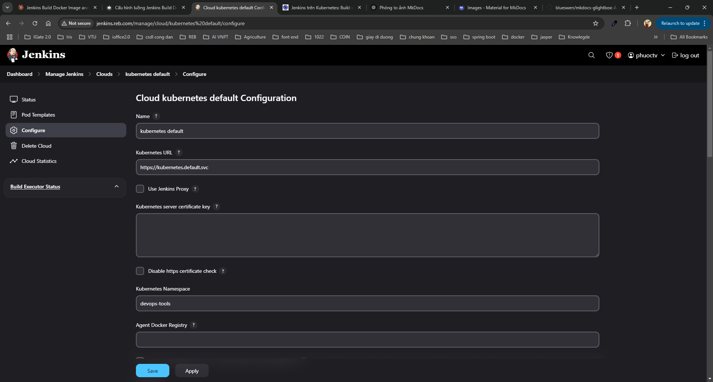

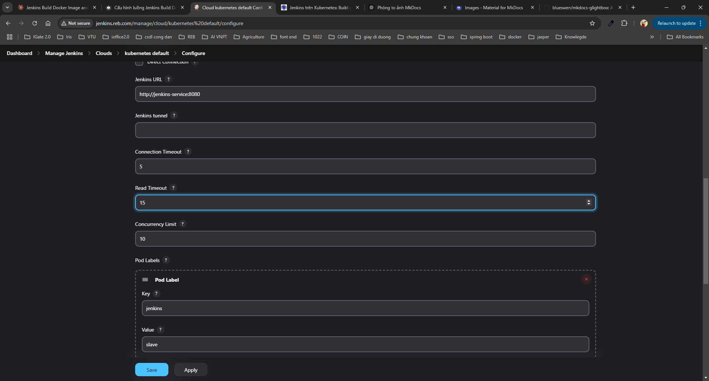

Tiếp tục vào Dashboard > Manage Jenkins > Clouds > kubernetes default > Pod Templates

Thêm Add a pod template nếu chưa có

Cấu hình các tham số sau:

- **Name**: kaniko
- **Namespace**: devops-tools
- **Labels**: docker-build
- **Usage**: Use this node as much as possible

- **Container Template**:
    - Cấu hình jnlp:
        - **Name**: jnlp
        - **Docker image**: jenkins/inbound-agent:alpine
        - **Working directory**: /home/jenkins/agent
        - **Command to run**: để trống
        - **Arguments to pass to the command**: trống
        - **Allocate pseudo-TTY**: Không tích
    - Cấu hình kaniko:
       - **Name**: kaniko
       - **Docker image**: gcr.io/kaniko-project/executor:debug
       - **Working directory**: /home/jenkins/agent
       - **Command to run**: /busybox/cat
       - **Arguments to pass to the command**: Trống 
       - **Allocate pseudo-TTY**: Tích

- **Volumes**:
    - **Secret Volume**:
        - **Secret name**: kaniko-secret
        - **Mount path**: /kaniko/.docker


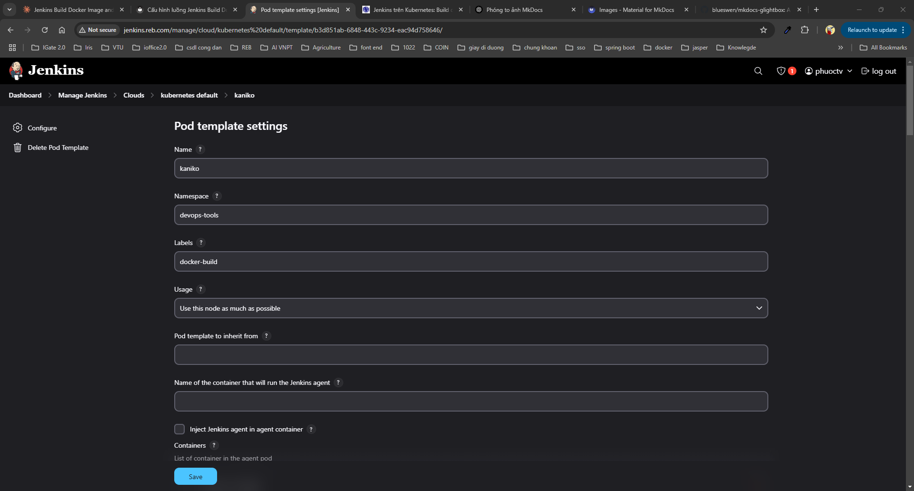

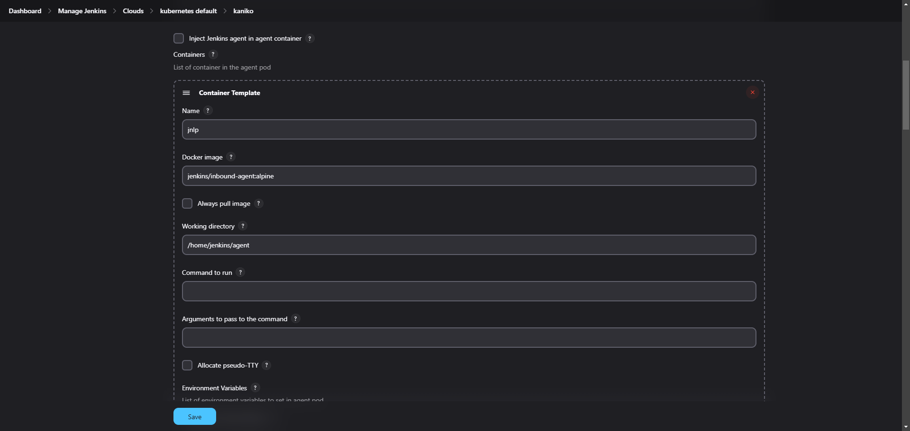

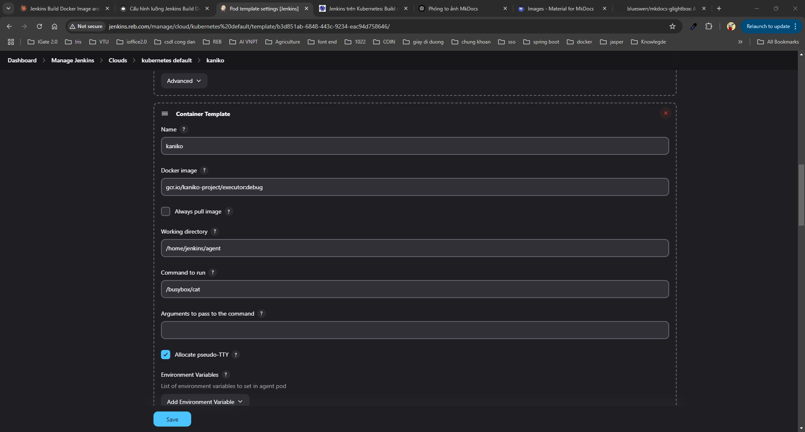

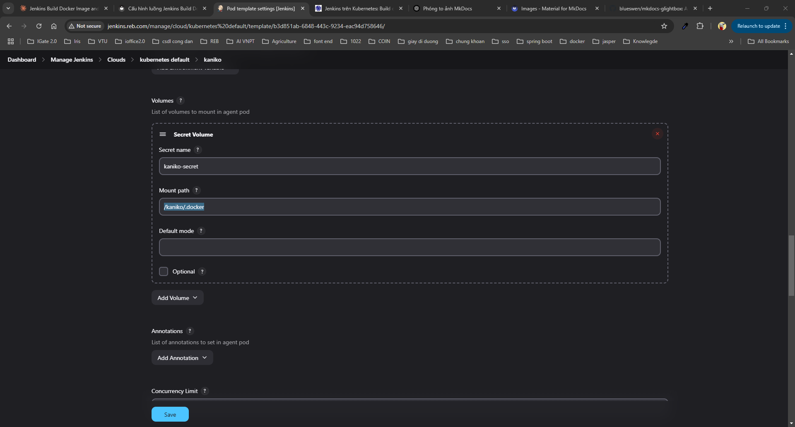

### 2.3. Cấu hình secret cho kaniko


```json linenums="1" title="config.json" 
{
    "auths": {
      "https://index.docker.io/v1/": {
        "auth": "XXXXXXXXXXXXXXXX"
      }
    }
  }
  
```

!!! note "Trong đó"

     "auth" có cấu trúc như sau: base64(username:Personal access tokens của docker hub). Ví dụ username là thaiphuoc1997, Personal access tokens của docker hub là ABC123
     Thì base64(thaiphuoc1997:ABC123) là dGhhaXBodW9jMTk5NzpBQkMxMjM=

     Lấy Personal access tokens của docker hub được lấy tại [personal-access-tokens](https://app.docker.com/settings/personal-access-tokens)
     

Sau đó trên k8s chạy lệnh

```bash 
kubectl -n devops-tools create secret generic kaniko-secret --from-file=config.json
```

### 2.4. Tích hợp vào Jenkin pipeline

Mã nguồn github: [https://github.com/vanphuoc9/complete-prodcution-e2e-pipeline.git](https://github.com/vanphuoc9/complete-prodcution-e2e-pipeline.git)


Dưới đây mình sẽ giới thiệu ví dụ đơn giản:


Chúng ta cần tạo 1 project, với các thông số cấu hình như dưới đây


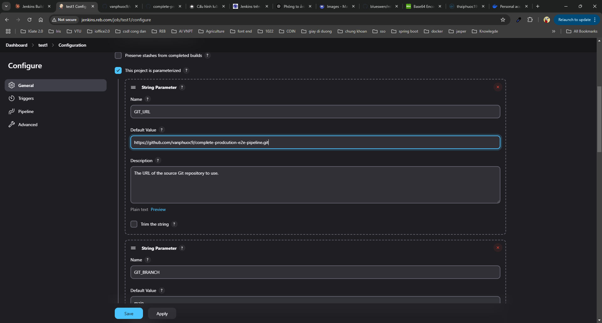

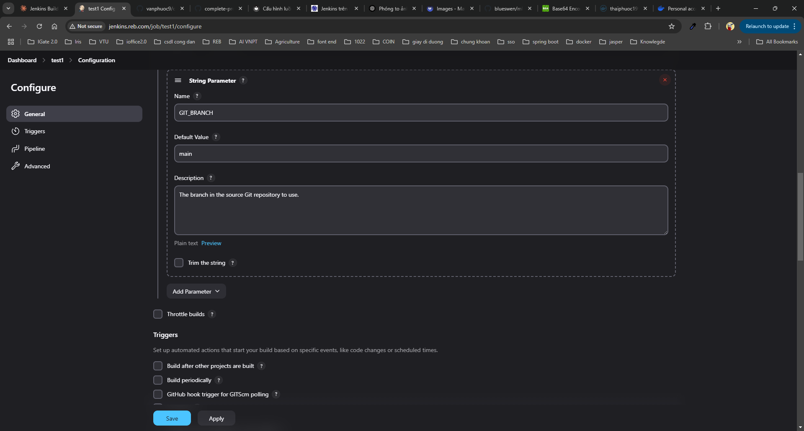

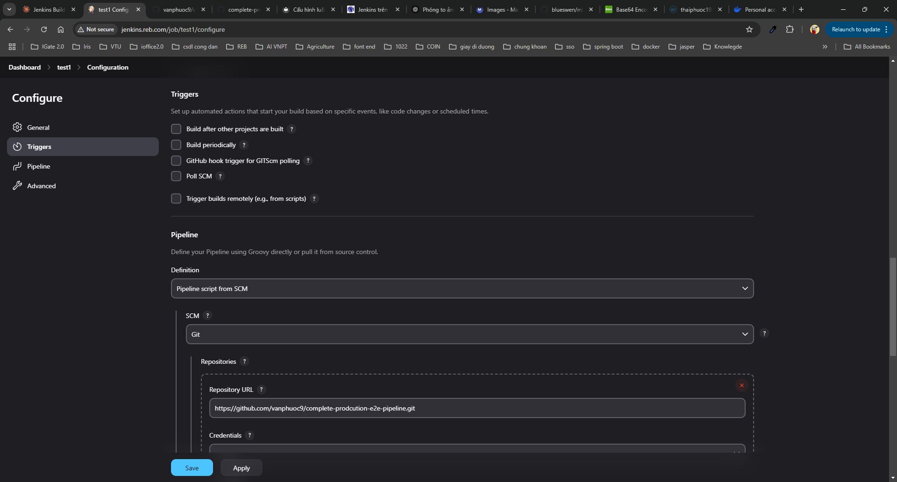

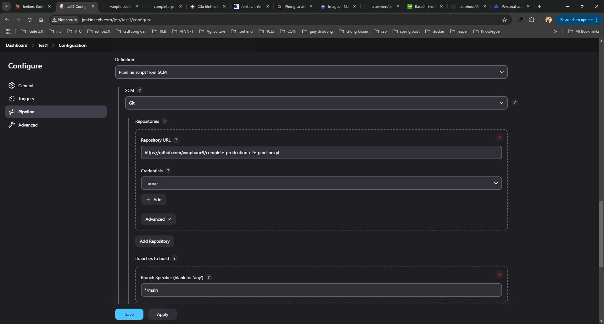

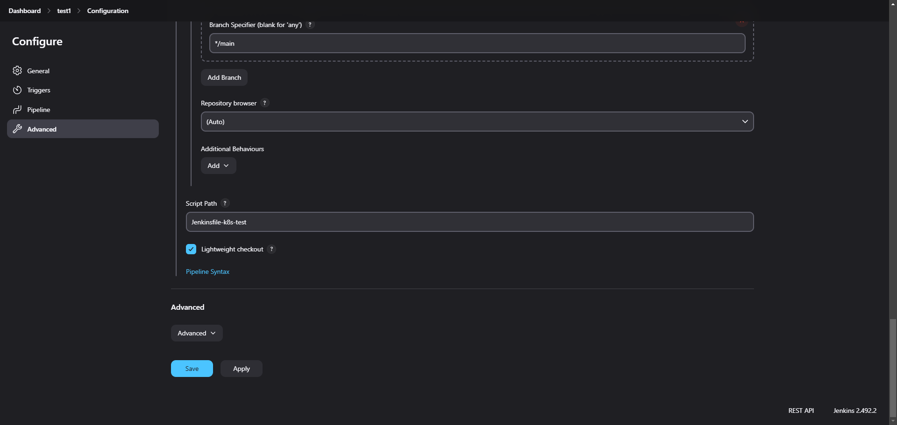


Các bước đơn giản:

- Checkout source code từ git
- Chạy pipeline với cấu hình được thiết lập trong Jenkinsfile


```pipeline linenums="1"
pipeline {
    agent any
    options {
        skipDefaultCheckout()
    }
    parameters {
        string(name:'GIT_URL', defaultValue:'https://github.com/vanphuoc9/complete-prodcution-e2e-pipeline.git', description:'The URL of the source Git repository to use.')
        string(name:'GIT_BRANCH', defaultValue:'main', description:'The branch in the source Git repository to use.')
    }
    stages {
        stage("Checkout") {
            steps {
                checkout(changelog: false, poll: false, scm: [
                    $class: 'GitSCM',
                    branches: [
                        [name: params.GIT_BRANCH],
                    ],
                    doGenerateSubmoduleConfigurations: false,
                    submoduleCfg: [],
                    userRemoteConfigs: [
                        [
                            url: params.GIT_URL,
                        ],
                    ],
                ])
                stash name: 'sources', includes: '**', excludes: '**/.git,**/.git/**'
            }
        }
        stage("Build docker") {
            agent {
                label 'docker-build'
            }
            steps {
                unstash 'sources'
                container(name: 'kaniko') {
                    sh '/kaniko/executor --context=`pwd` --dockerfile=`pwd`/Dockerfile  --destination=thaiphuoc1997/testk8s:latest'
                }
            }
        }
    }
}
```

### 2.5. Kết quả build jenkins

```bash 
.....
Downloaded from central: https://repo.maven.apache.org/maven2/org/eclipse/aether/aether-util/1.0.0.v20140518/aether-util-1.0.0.v20140518.jar (146 kB at 2.4 MB/s)
[INFO] Installing /app/pom.xml to /root/.m2/repository/com/dmancloud/dinesh/demoapp/1.0.0/demoapp-1.0.0.pom
[INFO] Installing /app/target/demoapp.jar to /root/.m2/repository/com/dmancloud/dinesh/demoapp/1.0.0/demoapp-1.0.0.jar
[INFO] ------------------------------------------------------------------------
[INFO] BUILD SUCCESS
[INFO] ------------------------------------------------------------------------
[INFO] Total time:  29.048 s
[INFO] Finished at: 2025-04-02T14:34:19Z
[INFO] ------------------------------------------------------------------------
INFO[0055] Taking snapshot of full filesystem...        
INFO[0062] Saving file app/target/demoapp.jar for later use 
INFO[0062] Deleting filesystem...                       
INFO[0063] Retrieving image manifest eclipse-temurin:17.0.6_10-jdk 
INFO[0063] Returning cached image manifest              
INFO[0063] Executing 0 build triggers                   
INFO[0063] Building stage 'eclipse-temurin:17.0.6_10-jdk' [idx: '1', base-idx: '-1'] 
INFO[0063] Unpacking rootfs as cmd COPY --from=build /app/target/demoapp.jar /app/ requires it. 
INFO[0078] WORKDIR /app                                 
INFO[0078] Cmd: workdir                                 
INFO[0078] Changed working directory to /app            
INFO[0078] Creating directory /app with uid -1 and gid -1 
INFO[0078] Taking snapshot of files...                  
INFO[0078] COPY --from=build /app/target/demoapp.jar /app/ 
INFO[0078] Taking snapshot of files...                  
INFO[0078] EXPOSE 8080                                  
INFO[0078] Cmd: EXPOSE                                  
INFO[0078] Adding exposed port: 8080/tcp                
INFO[0078] CMD ["java", "-jar","demoapp.jar"]           
INFO[0078] Pushing image to thaiphuoc1997/testk8s:latest 
INFO[0101] Pushed index.docker.io/thaiphuoc1997/testk8s@sha256:e1b75b3a4a1356d44a747e0d7092e99273ff607b473bf6d9945a28ab685db1ed 
[Pipeline] }
[Pipeline] // container
[Pipeline] }
[Pipeline] // node
[Pipeline] }
[Pipeline] // stage
[Pipeline] }
[Pipeline] // node
[Pipeline] End of Pipeline
Finished: SUCCESS
```

Kết quả jenkins đã build source và đẩy thành công image lên docker hub

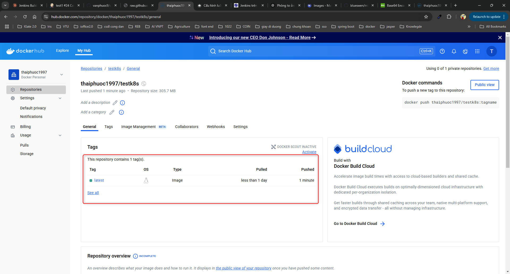

**Như vậy jenkins đã lấy source từ github sau đó dùng kaniko để build Dockerfile có trong source, sau đó đẩy image lên docker hub, bài viết kế tiếp mình sẽ giới thiệu luồng kế tiếp argocd dùng image của trên docker hub để deployment ứng dụng lên k8s**

## 3. Tài liệu tham khảo

- [Jenkins trên Kubernetes: Build docker image bằng Kaniko](https://nvtienanh.info/blog/jenkins-tren-kubernetes-build-docker-image-bang-kaniko)
- [How to Install Jenkins in Kubernetes with Kaniko for Container Building](https://www.youtube.com/watch?v=qSK3HNirASU)