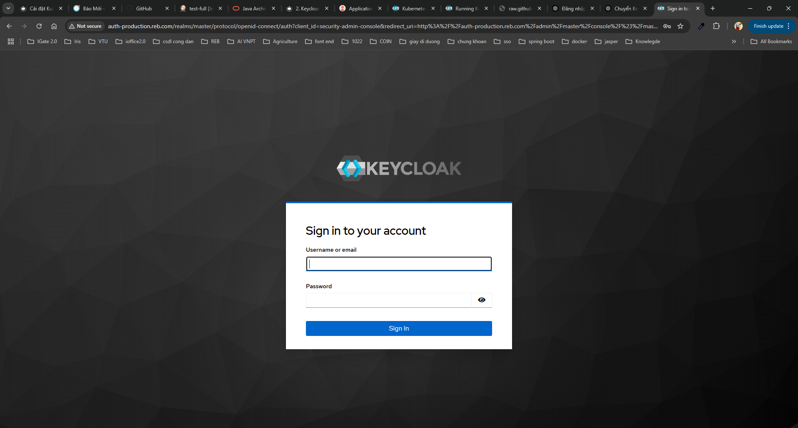
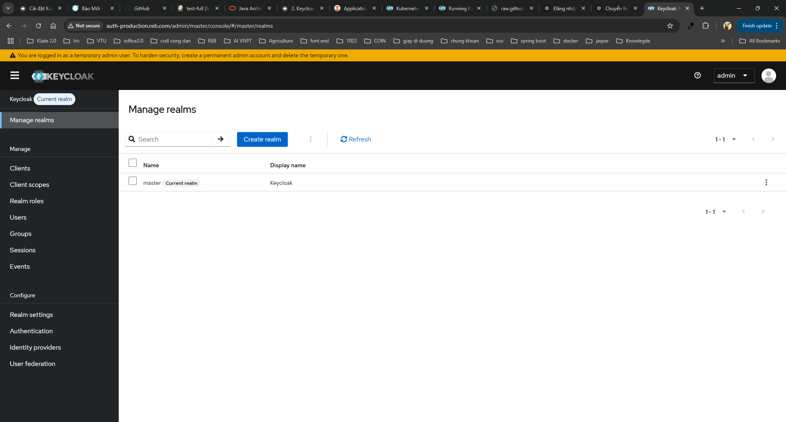

# Cài đặt keycloack trên k8s

## 1. Giới thiệu

Đăng nhập một lần (Single-Sign On)
Người dùng sẽ xác thực thông qua Keycloak thay vì từng ứng dụng riêng lẻ. Điều này có nghĩa là các ứng dụng của bạn không cần phải xử lý biểu mẫu đăng nhập, xác thực người dùng hay lưu trữ thông tin người dùng. Sau khi đã đăng nhập vào Keycloak, người dùng không cần phải đăng nhập lại khi truy cập các ứng dụng khác.

Điều này cũng áp dụng cho việc đăng xuất. Keycloak hỗ trợ đăng xuất một lần (single-sign out), nghĩa là người dùng chỉ cần đăng xuất một lần để được đăng xuất khỏi tất cả các ứng dụng sử dụng Keycloak.

## 2. Cài đặt theo cách thủ công

Github chứa file cài đặt: [https://github.com/vanphuoc9/install-keycloack-k8s.git](https://github.com/vanphuoc9/install-keycloack-k8s.git)

### 2.1. Cài đặt database cho keycloack

Trong dự án án này mình sẽ sử dụng postgres cho keycloack để việc cài đặt dễ dàng hơn, nếu sử dụng production anh em có thể cân nhắc sử dụng oracle database làm database cho keycloack.


Tạo namespace dev nếu chưa tạo

```bash 
kubectl create namespace dev
```
#### 2.1.1. Tạo PV và PVC chứa DB postgres


```yaml title="postgres-keycloack-pv.yaml"  linenums="1"
apiVersion: v1
kind: PersistentVolume
metadata:
  name: postgres-keycloack-pv-volume
  namespace: dev
  labels:
    type: local
spec:
  storageClassName: manual
  capacity:
    storage: 20Gi
  accessModes:
    - ReadWriteOnce
  nfs:
    path: /mnt/nfs_share/keycloack
    server: 192.168.1.110  # Thay bằng IP NFS Server
    readOnly: false
---
apiVersion: v1
kind: PersistentVolumeClaim
metadata:
  name: postgres-keycloack-pv-claim
  namespace: dev
spec:
  storageClassName: manual
  accessModes:
    - ReadWriteOnce
  resources:
    requests:
      storage: 20Gi

---

```


#### 2.1.2. Tạo secret cho postgres

```yaml title="postgres-secret.yaml"  linenums="1"
apiVersion: v1
kind: Secret
metadata:
  name: postgres-secret
  namespace: dev
type: Opaque
data:
  postgres-root-username: cmViTW92aWU=
  postgres-root-password: cmViTW92aWVAMTIz
```


#### 2.1.2. Cài đặt Deployment và Service cho postgres

```yaml title="postgres-keycloack-dp.yaml"  linenums="1"
apiVersion: apps/v1
kind: Deployment
metadata:
  name: postgres-keycloack
  namespace: dev
spec:
  replicas: 1
  selector:
    matchLabels:
      app: postgres-keycloack
  template:
    metadata:
      labels:
        app: postgres-keycloack
    spec:
      containers:
      - name: postgres-keycloack
        image: postgres:16.3
        ports:
        - containerPort: 5432
        env:
        - name: POSTGRES_USER
          valueFrom: 
            secretKeyRef:
              name: postgres-secret
              key: postgres-root-username
        - name: POSTGRES_PASSWORD
          valueFrom: 
            secretKeyRef:
              name: postgres-secret
              key: postgres-root-password
        - name: POSTGRES_DB
          value: keycloackdb
        volumeMounts:
        - name: postgres-keycloack-persistent-storage
          mountPath: /var/lib/postgresql/data
      volumes:
      - name: postgres-keycloack-persistent-storage
        persistentVolumeClaim:
          claimName: postgres-keycloack-pv-claim
---
apiVersion: v1
kind: Service
metadata:
  name: postgres-keycloack-service
  namespace: dev
spec:
  selector:
    app: postgres-keycloack
  ports:
    - protocol: TCP
      port: 5432
      targetPort: 5432


```


### 2.2. Cài đặt Deployment và Service cho keycloack


```yaml title="keycloak.yaml"  linenums="1"
apiVersion: apps/v1
kind: Deployment
metadata:
  name: keycloak
  namespace: dev
  labels:
    app: keycloak
spec:
  replicas: 1
  selector:
    matchLabels:
      app: keycloak
  template:
    metadata:
      labels:
        app: keycloak
    spec:
      containers:
        - name: keycloak
          image: quay.io/keycloak/keycloak:26.2.0
          args: ["start-dev"]
          env:
            - name: KEYCLOAK_ADMIN
              value: admin
            - name: KEYCLOAK_ADMIN_PASSWORD
              value: admin
            - name: KC_DB
              value: postgres
            - name: KC_DB_URL
              value: jdbc:postgresql://postgres-keycloack-service:5432/keycloackdb
            - name: KC_DB_USERNAME
              valueFrom: 
                secretKeyRef:
                  name: postgres-secret
                  key: postgres-root-username
            - name: KC_DB_PASSWORD
              valueFrom: 
                secretKeyRef:
                  name: postgres-secret
                  key: postgres-root-password
          ports:
            - name: http
              containerPort: 8080
          readinessProbe:
            httpGet:
              path: /realms/master
              port: 8080
---
apiVersion: v1
kind: Service
metadata:
  name: keycloak-service
  labels:
    app: keycloak
    namespace: dev
spec:
  selector:
    app: keycloak
  ports:
    - name: http
      port: 8080
      targetPort: 8080

```

### 2.3. Tạo ingress cho keycloack


```yaml title="ingress.yaml"  linenums="1"
apiVersion: networking.k8s.io/v1
kind: Ingress
metadata:
  name: ingress-reb-dev
  namespace: dev
  annotations:
    nginx.ingress.kubernetes.io/proxy-body-size: "500m"
spec:
  ingressClassName: nginx
  rules:
  - host: auth-production.reb.com
    http:
      paths:
      - pathType: Prefix
        path: "/"
        backend:
          service:
            name: keycloak-service
            port:
              number: 8080


```

### 2.4. Cấu hình domain cho auth-production.reb.com


```bash 
192.168.1.50 auth-production.reb.com 
```

!!! note "Lưu ý"

    Lưu ý, 192.168.1.50 là [External IP của ingress của bài viết trước](Cài đặt Metallb.md)

### 2.5. Đăng nhập

Sau khi chạy các file trên k8s thì khi truy cập http://auth-production.reb.com thì sẽ thấy giao diện như sau:




- Tài khoản: admin
- Mật khẩu: admin

