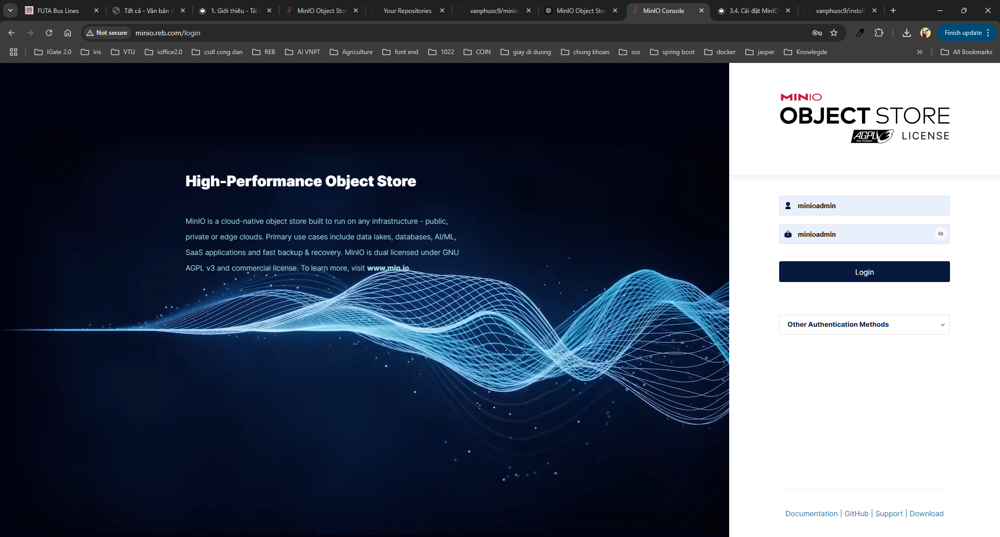
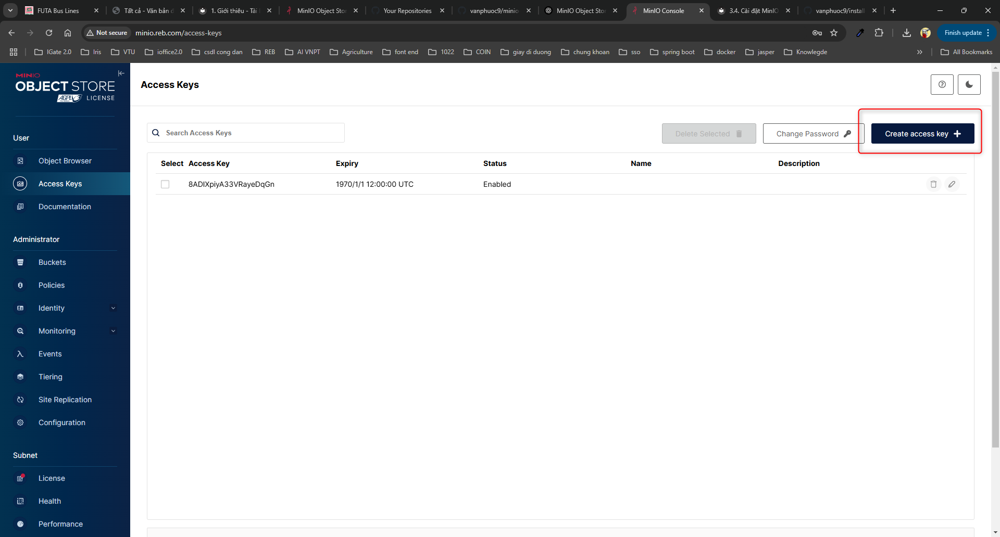
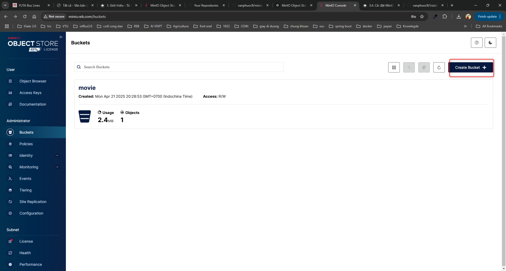

# Cài đặt Minio trên k8s

## 1. Giới thiệu

MinIO là một giải pháp lưu trữ đối tượng (object storage) hiệu suất cao, tương thích hoàn toàn với giao thức Amazon S3, rất thích hợp để triển khai trong nhiều môi trường khác nhau — từ đám mây công cộng, nội bộ, hệ thống bare-metal đến cả môi trường edge.

Một số điểm nổi bật của MinIO:

✅ Tương thích với S3: Bạn có thể sử dụng các công cụ, SDK, và dịch vụ thiết kế cho S3 với MinIO mà không cần thay đổi gì nhiều.

⚙️ Triển khai linh hoạt: MinIO có thể chạy độc lập (standalone), phân tán (distributed) hoặc tích hợp trong các cụm Kubernetes.

🚀 Hiệu suất cao: Tối ưu cho các workload yêu cầu tốc độ cao như AI/ML, phân tích dữ liệu lớn, CI/CD.

🔐 Bảo mật: Hỗ trợ TLS, xác thực, quyền truy cập theo bucket/policy.

📦 Tối giản và dễ triển khai: Một binary duy nhất, dễ cấu hình.

## 2. Cài đặt 

Github: [https://github.com/vanphuoc9/install-minio-k8s.git](https://github.com/vanphuoc9/install-minio-k8s.git)

### 2.1. Tạo PV và PVC 


```yaml title="minio-pv.yaml"  linenums="1"
kind: PersistentVolume
apiVersion: v1
metadata:
  name: minio-pv-volume
  namespace: dev
spec:
  storageClassName: miniostorageclass
  capacity:
    storage: 5Gi 
  accessModes:
    - ReadWriteOnce
  nfs:
    server: "192.168.1.110"
    path: "/mnt/nfs_share/minio-data/"

---

kind: PersistentVolumeClaim
apiVersion: v1
metadata:
  name: minio-pv-claim
  namespace: dev
spec:
  storageClassName: miniostorageclass
  accessModes:
    - ReadWriteOnce
  resources:
    requests:
      storage: 5Gi


```

### 2.2. Cài đặt Deployment và Service


```yaml title="minio-pv.yaml"  linenums="1"
apiVersion: apps/v1
kind: Deployment
metadata:
  name: minio
  namespace: dev
spec:
  replicas: 1
  selector:
    matchLabels:
      app: minio
  template:
    metadata:
      labels:
        app: minio
    spec:
      containers:
      - name: minio
        image: minio/minio:RELEASE.2024-08-17T01-24-54Z.fips
        args:
        - server
        - /data
        - "--console-address=:9090"  # Cấu hình port cho WebUI
        env:
        - name: MINIO_ROOT_USER
          value: "minioadmin"
        - name: MINIO_ROOT_PASSWORD
          value: "minioadmin"
        ports:
        - containerPort: 9000
        - containerPort: 9090  # Port cho WebUI
        volumeMounts:
        - name: minio-storage
          mountPath: /data
      volumes:
      - name: minio-storage
        persistentVolumeClaim:
          claimName: minio-pv-claim
---
apiVersion: v1
kind: Service
metadata:
  name: minio-service
  namespace: dev
spec:
  type: NodePort
  selector:
    app: minio
  ports:
    - protocol: TCP
      port: 9000
      targetPort: 9000
      nodePort: 30012
---
apiVersion: v1
kind: Service
metadata:
  name: minio-webui-service
  namespace: dev
spec:
  type: ClusterIP
  selector:
    app: minio
  ports:
    - protocol: TCP
      port: 9090
      targetPort: 9090
     # nodePort: 30012

```


### 2.3. Tạo ingress cho keycloack


```yaml title="ingress.yaml"  linenums="1"
apiVersion: networking.k8s.io/v1
kind: Ingress
metadata:
  name: ingress-minio
  namespace: dev
  annotations:
    nginx.ingress.kubernetes.io/proxy-body-size: "500m"
    nginx.ingress.kubernetes.io/rewrite-target: /
    nginx.ingress.kubernetes.io/proxy-http-version: "1.1"
    nginx.ingress.kubernetes.io/proxy-read-timeout: "3600"
    nginx.ingress.kubernetes.io/proxy-send-timeout: "3600"
    nginx.ingress.kubernetes.io/use-regex: "true"
    nginx.ingress.kubernetes.io/enable-websocket: "true"
    # nginx.ingress.kubernetes.io/configuration-snippet: |
    #   proxy_set_header Upgrade $http_upgrade;
    #   proxy_set_header Connection "Upgrade";
    nginx.org/websocket-services: "minio-webui-service"
   
spec:
  ingressClassName: nginx
  rules:
  - host: minio.reb.com
    http:
      paths:
      - pathType: Prefix
        path: "/"
        backend:
          service:
            name: minio-webui-service
            port:
              number: 9090
  
 


```

### 2.4. Cấu hình domain cho auth-production.reb.com


```bash 
192.168.1.50 minio.reb.com
```

## 3. Cấu hình

Vào đường dẫn minio.reb.com, đăng nhập với 
- Tài khoản: minioadmin 
- Mật khẩu: minioadmin



Tạo Access Keys dùng để service gọi vào minio



Tạo Buckets

